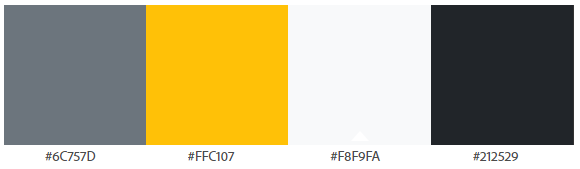
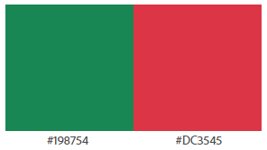

# Boardgame Bazaar - Readme document
<p>
  
</p>

### Website can be viewed here: https://boardgame-bazaar.herokuapp.com/
### Project Github site: https://github.com/C-Undritz/Boardgame-Bazaar
### **Disclaimer: This Website is for educational purposes only.**

------
<span id="top"></span> 
# Table of Contents 

- [OVERVIEW](#overview)
- [STRATEGY](#strategy)
- [STRUCTURE](#structure)
- [SKELETON](#skeleton)
- [SURFACE](#surface)
- [TECHNOLOGIES USED](#technologies-used)
- [TESTING](#testing)
- [FEATURES](#features)
- [FURTHER DEVELOPMENT](#further-development)
- [DEVELOPMENT AND DEPLOYMENT](#development-and-deployment)
- [DOCUMENTATION REFERENCED](#documentation-referenced)
- [CREDITS AND THANKS](#credits-and-thanks)

------

> # **OVERVIEW**
Boardgame Bazaar is a dedicated online board game store, where customers can easily navigate to view games organised and presented within a number of categories and genres.  Genres and categories are assigned by admin users or are determined through functions based on the saved product data.  Controls exist to preserve stock levels during purchasing so customers are aware as to what is available and are prevented from buying a product that is out of stock.  This combined with an intuitive interface aims to deliver a smooth and enjoyable customer experience to maximise repeat visits to the site

------

> # **STRATEGY**
The board game industry has seen resurgence in recent years and it is expected to carry on growing further.  Industry forecasters predict the global board game market will be worth more than £9bn by 2023.  For many gamers, the enjoyment of playing board and card games among friends, family members, and fellow enthusiasts is invaluable and they are willing to pay for the experience, with the majority of gamers (41%) purchasing five to ten new games or expansions a year.

Consequently whilst there are plenty of online board game stores, there is still room in the market for a new store to thrive and succeed.  The goal of this project is to produce an e-commerce store dedicated to the sale of new table top board games.   Whilst other stores offer board games and associated paraphernalia, the focus of boardgame Bazaar will be the sale of the core experience: Games and associated expansions.

<div align="right"><a href="#top">Contents Table</a></div>

# User Stories

| User Story ID | As A        | I want to be able to...                                      | So that I can..                                              |
| ------------- | ----------- | ------------------------------------------------------------ | ------------------------------------------------------------ |
|               |             |                                                              |                                                              |
| 01-01         | Customer    | View all of the products available from the store            | Select a product to purchase                                 |
| 01-02         | Customer    | View a list of products that are on sale, just released and available for pre-order | Take advantage of savings, and purchase a new product early  |
| 01-03         | Customer    | Select individual products to view                           | Read additional product details to confirm that this is the item I am looking for and add to my shopping cart (nth: view reviews and ratings on the product) |
| 01-04         | Customer    | See what is popular                                          | See what other customers are buying and whether I want the same                |
| 01-05         | Customer    | Access my shopping cart at any time                          | Check added items and view the purchase total to ensure that I am not spending too much |
|               |             |                                                              |                                                              |
| 02-01         | Customer    | View the products available by board game genres             | More easily find games that match my board game preferences  |
| 02-02         | Customer    | Sort the returned list of board games                        | Easily identify the cheapest/most expensive board games and most highly rated |
| 02-03         | Customer    | Be able to search for a board game by name or description    | Find a specific board game that I am looking to purchase     |
| 02-04         | Customer    | Easily view the search results                               | Quickly determine whether the product I want is available    |
|               |             |                                                              |                                                              |
| 03-01         | Customer    | Easily select the quantity of a board game I would like to buy | Buy multiples of one product in the same purchase            |
| 03-02         | Customer    | View the items in the shopping cart that I have selected to purchase | Keep track of what I have added and the total cost           |
| 03-03         | Customer    | Adjust the quantity of the individual items in my shopping cart and remove them if I wish | Easily make changes to my purchase before checkout           |
| 03-04         | Customer    | Easily enter delivery and payment information                | Check out quickly and confidently with zero hassle           |
| 03-05         | Customer    | Feel that my personal and payment information is safe and secure | Confidently provide the needed information to make a purchase |
| 03-06         | Customer    | View an order after a purchase is made and checkout is complete | Verify that I have not made any mistakes in my order         |
| 03-07         | Customer    | Receive an email confirmation after checkout is complete     | Have a record of what has been purchased should there be any issues |
|               |             |                                                              |                                                              |
| 04-01         | Customer    | Easily communicate with Boardgame Bazaar                     | Ask about an items availability or chase an order |
| 04-02         | Customer    | Sign up for the newsletter                                   | Be kept up to date with the latest news and offers |
| 04-03         | Customer    | Link to boardgame bazaar social media                        | Be kept up to date with the latest news and announcements     | 
|               |             |                                                              |                                                              |
| 05-01         | Site User   | Easily register for an account                               | Have a personal account, a profile to view and streamline the checkout |
| 05-02         | Site User   | Receive an email confirmation after registering              | Be sure that my account is created and verify that it is myself that set it up |
| 05-03         | Site User   | Easily log in or log out                                     | Access my personal account and streamline the checkout       |
| 05-04         | Site User   | Easily recover my password in case I forget it               | Recover access to my account                                 |
| 05-05         | Site User   | Have a personalised account page                             | View order history, wishlist, and save, view and update contact and delivery information |
| 05-06         | Site User   | Add/remove games that I may purchase to a wishlist           | Easily find them should I wish to purchase them later |
| 05-07         | Site User   | Manage whether I receive a news letter                       | Decide not to receive it should I not find it useful/interesting |
| 05-08         | Site User   | Add and edit a review of any item I purchase                 | Provide my opinion which may help other potential buyers of the product |
|               |             |                                                              |                                                              |
| 06-01         | Store Owner | Add a product                                                | Add new items to the store through streamlined interface     |
| 06-02         | Store Owner | Edit and Update a product details                            | Change product prices, descriptions, images, and other product criteria |
| 06-03         | Store Owner | Delete a product                                             | Remove items that are no longer available to buy             |
| 06-04         | Store Owner | Manage the attributes assigned to a product                  | Display and categorise products                              |
| 06-05         | Store Owner | Track and manage stock of each item                          | Know when I need to order more and track pre-order demand    |
| 06-06         | Store Owner | Provide a secure shopping experience                         | Have customers confidently returning to the store                 |

<div align="right"><a href="#top">Contents Table</a></div>

------

> # **STRUCTURE**

The website functionality delivered against the user stories is broadly separated into three categories:

1. Sections and functions accessible whilst not being logged in:
* Free text search.
* Full product navigation from the Navbar shop front and shop by genre Menu.
* View product description.
* Purchase of products.
* Received purchase confirmation.

2. Sections and functions accessible when registered and logged in:
* All of the above.
* An account page where account details can be managed, orders can be viewed, wishlist managed, products reviewed and rated. 

3. Sections and functions accessible when logged in as an admin user:
* All of the above
* Admin functions consisting of the ability to add, edit and delete products and genre, update stock and receive customer communications.

# Navigation
The main site navigation is facilitated by the navbar.  However navigation options exist within the pages to facilitate the purchasing process or allow the customer to continue shopping.

## Navbar
- The Navbar is displayed at all resolutions and is a permanent navigation feature.
- 'Home' icon to navigate the customer to the home page from any page within the site.  
- Shop Front displays a drop-down menu that displays the available board games by 'all products', 'bestsellers', 'new releases', 'pre-orders' and 'on sale'.  
- Shop by Genre displays a drop-down menu that displays the available board games by genres that have been assigned to each game.
- The navigation menu is responsive and so content collapses behind a button on tablet and mobile screens
- Clicking or tapping the brand navigates the user to the landing pages from any page within the site.  The logo is displayed at all resolutions.

### Free text search
- The search bar will return any board games that contain the user input search parameter in the product title or description.
- Displayed as a bar at desktop resolutions and as a button at tablet and mobile resolutions.  Button is tapped to display a search bar.

### Social icons
- Social icons link to their respective sites and open the social network site within a new browser tab.  
- Displayed permanently within the foot and in the navbar on desktop screens only.

### Account buttons
- Conditional display of icons and text to login, register, access account, and logout.  Each navigates to the appropriate page.  
- Displayed in navbar at all resolutions though text is not shown on mobile screens; only the icons.
- Admin functions are available within a user account if the user has admin status.

### Footer
- Social media icons permanently displayed
- links to information and legal pages.

### Product Display
- Clicking or tapping on the product image navigates the user to the product detail page for that product.
- Within the product detail page clicking on any of the genre tags will display all products assigned that genre.
- Back button displayed at the top will take the user back to the previous screen
- Keep shopping button takes the user to the all products display.

### Shopping cart
- Whilst shopping, a preview of the shopping cart is displayed upon the addition an item to the cart.  This is done via a bootstrap5 Offcanvas component.  From within the Offcanvas the customer can select to view the shopping cart page or continue shopping.  The Offcanvas is displayed at all resolutions.
- The shopping cart can be accessed at any point by clicking on the shopping cart symbol in the top right of navbar which will take the user to the shopping cart page.
- From the cart page two buttons are displayed that will take the user to the checkout page, or keep shopping which will return them to the all products view

## Checkout Page
- Adjust cart button will return the customer to the cart page
- Selecting complete order will complete the purchase action and if successful the checkout success page will display.

## Account Page
- Each button displays the appropriate content on the right (or below at mobile resolutions).
- Selecting logout will take the customer to the log out page

## Order history
- Selecting the order ref (shown in blue) displays the details page for that order
- Back button returns the user to the order history
- Review button takes the user to the review page where they can review and rate the purchased product.

## Admin Page
- The admin button shows within the account page if the user has admin privileges.
- the admin menu displays buttons for add product, edit product, add genre and edit genre.
- the edit buttons display a list of database records and alongside each the option to edit or delete that record.

<div align="right"><a href="#top">Contents Table</a></div>

# Communication
There are several ways the site has been set up to communicate with the customer and facilitate customer communications with the business.

## Pop-up messages
- Short pop up messages confirming actions and issues whilst interacting with the site.
- Categorised as 'success', 'info', 'error' and 'warning' messages.
- Delivered via bootstrap5 toasts component.

## Confirmation emails
- Automatic emails are sent to the customers address upon registering, for password reminders, and the completion of purchases.
- Facilitated via the Django send_mail function.

## Contact Page
- Presented as a form for the customer to fill in and is accessed from the navbar or footer from the envelope icon.
- Sent automatically to the configured email address by the customer clicking the send button
- Uses a configured email text template file to present the information in a formatted structure
- Facilitated via the Django send_mail function.

## Newsletter
- Open to all customers; the customer does not have to be registered to use this function and sign up.
- registered users can manage their subscription status to the news letter from within the account pages.
- Provides alternative to customers who do not wish to engage with social media

## Social media
- Links to the most popular social media platforms from the navbar or footer.
- Allows customers to keep up to date with the latest news and announcements.

<div align="right"><a href="#top">Contents Table</a></div>

# Database Schema
A relational database has been used to deliver the expected functionality.  SQLite was used in the development of the site and Postgres provided by the Heroku platform was used in production.  The diagram below shows the database models and relationships between each.


## Models

### Product
* Contains all of the information needed to directly display information about the product.
* Value for the name field is saved as a lowercase value so duplicate checking can be performed against this field.
* Many to many relationship to the Genre model allows many Genres to be assigned to a product.
* Boolean value 'on_sale' manually selected by admin for the product to be displayed as 'on sale' and display the sale price.
* Stock and sold values updated by a post save signal from the checkout app OrderLineItem model
* pre_order and new_release Boolean values are updated by a CustomManager function called each time the products database queried.  The 'def determine_new_or_preorder' function within the custom manager runs queries against the release date value of the products and the current date to determine the true/false status of these.
* rating is a rounded average value of all reviews submitted against the product.  it is updated by a post save and post delete signal from the products app Review model.

### Genre
* An attribute of the product model only and displayed with product information
* Many to many relationship to the Product model allows many Products to be assigned to a Genre.
* name field offers a more 'code friendly' version of the name value.  Admin is guided to provide this value without spaces (using underscores).  This is however, not enforced or checked.
* friendly_name is the value used to display the genre name within the site.
* Values for both fields saved as lowercase values so duplicate checking can be performed, though duplicate checking only currently performed on the friendly name field
* A through table (GenreAssignent) implemented for the product genre assignment so that this could be viewed, edited and controlled via the admin interface if required.

### Review
* Links together a review with the user and product which is then used to check if the user has already reviewed a product.  This determines whether a blank form is returned when selecting review or whether the form is displayed with the existing user review for the product in question.
* review holds review text of a maximum of 500 characters.  
* rating is a whole number value between 1 and 5.

### User
* Generated automatically by Django when a customer registers an account.
* username and email are mandatory fields and value taken during registration
* first_name and last_name are not mandatory fields, but are required during checkout.

### UserProfile
* Contains contact and address details for the user.
* Not mandatory fields but are required during checkout for the delivery and contact information to facilitate delivery of a product.
* Many to many relationship to the Product model to facilitate the wishlist functionality governed through the 'profiles_userprofile_wishlist' auto generated model.
* A defined wishlist through table was not implemented and Django was left to control this as this would be customer personal data and so the relationships should not be viewed by any admin users.

### MailingList
* Not linked to any other model as this can contain the email (and dated added) of any customer that visits the site; they do not have to be registered.
* Checks against the saved email value in the User model are performed to determine if the User email value is within the MailingList database to provide mailing list status within the account information page.
* An alternative implementation of the same functionality could have required a Boolean value within the UserProfile model to check for mailing status.  However as the MailingList model can hold email addresses of none registered users, such an approach would offer little benefit over the implemented solution.

### Order
* Stores all information relating to the order including the products and quantity bought (stored with the OrderLineItem model), associated user profile, delivery details and order totals.
* Works out the total through the update_total method and automatically applies the discount depending on quantity bought at the point of purchase.

### OrderLineItem 
* Contains the information of each product and quantity of that product associated with each Order.

<div align="right"><a href="#top">Contents Table</a></div>

> # **SKELETON**

# Wireframes
There are some notable design changes against the original plan for the project.  Therefore the wireframes were updated during the project development to help guide the implementation of these.  The final wireframes are linked below.

[wireframes_v1.0](assets/readme/boardgame-bazaar_desktop-wireframes_v1.0.pdf)

The archived wireframes created at the start of the project can be accessed [here](assets/readme/boardgame-bazaar_desktop-wireframes_v0.1.pdf)

# Noted Design Changes
## Removed
* Selling 2nd hand games to the store to obtain store credit was not implemented due to time constraints and complexity of the full implementation of this

## Additional features
* More intuitive account and admin page presentation and navigation
* Admin functions on product detail page
* flash across product images (The tags across images stating 'new release', 'pre-order' and 'on sale')
* More attractive landing/home page
* Mailing list function

<div align="right"><a href="#top">Contents Table</a></div>

------
> # **SURFACE**
# Colours
In order to simplify the deployment of the website, bootstrap colours have been used as detailed below:

## Main colours



| Bootstrap colour | #hex code |
|------------------|-----------|
| Secondary        | #6C757D   |
| Warning          | #FFC107   |
| Light            | #F8F9FA   |
| Dark             | #212529   |

## Additional colours
These are only used as background to the flashes across images.  


| Bootstrap colour | #hex code |
|------------------|-----------|
| Danger           | #DC3545   |
| Success          | #198754


# Text
## Fonts
- [Love Ya Like A Sister](https://fonts.google.com/specimen/Love+Ya+Like+A+Sister?preview.text=Boardgame%20Bazaar&preview.text_type=custom&query=Love): Used for the title of the store in the nav bar
- [Economica](https://fonts.google.com/specimen/Economica?query=economica&preview.text=Boardgame%20Bazaar%20website%20content%20will%20be%20written%20in%20this%20font&preview.text_type=custom): Used for all text throughout the site  

# User interaction feedback
## Buttons
All buttons change colour upon mouse hover using the main bootstrap colours detailed above

## Navbar and footer text and icons
All change colour from white, or Bootstrap light, to Bootstrap warning upon mouse hover

<div align="right"><a href="#top">Contents Table</a></div>

------

> # **TECHNOLOGIES USED**

## Languages

- HTML5
- CSS3
- JavaScript
- Python

## Libraries & Frameworks

- [Django web application framework](https://www.djangoproject.com/)
- [Bootstrap v5.1.0](https://getbootstrap.com/)
- [Font Awesome](https://fontawesome.com/)
- [Google Fonts](https://fonts.google.com/)
- [jQuery](https://jquery.com/)

## Tools

- [Gitpod](https://www.gitpod.io/) - chosen IDE for this project.
- [GitHub](https://github.com/) - for storage and sharing of code remotely.
- [Heroku](https://www.heroku.com/) - Hosting provider for app.
- [Amazon Web Services (AWS)](https://aws.amazon.com/) - for hosting of all image files
- [Stripe](https://stripe.com/gb) - for processing of payments
- [Gmail](https://www.google.com/) - service used for Django to send emails
- [allauth](https://django-allauth.readthedocs.io/en/latest/index.html) - for site user login and logout of account
- [Django Crispy Forms](https://django-crispy-forms.readthedocs.io/en/latest/) - for control of the rendering behavior on the Django forms
- [Balsamiq](https://balsamiq.com/) - to create wireframes.
- [Lucidchart](https://www.lucidchart.com/) - for DB design illustration.
- [Tables Generator](https://www.tablesgenerator.com) - to generate the user stories table for this document.
- [jsonformatter.org](https://jsonformatter.org/) - creating json fixture files.
- [favicon](https://favicon.io/) - for generating 32x32 favicon.
- [Am I responsive](http://ami.responsivedesign.is/) - to create the responsive illustrations featured in the TESTING.md.
- [MS PowerPoint](https://en.wikipedia.org/wiki/Microsoft_PowerPoint) - to remove the background on some images.

<div align="right"><a href="#top">Contents Table</a></div>

------

> # **TESTING**

Unfortuanately time did not allow for any thorough automated testing.  Writing automated tests using Django's unit tests will form part of the intended future work for this project and be completed before any futher development on the site is started.

Testing completed is detailed in the [TESTING.md](https://github.com/C-Undritz/Boardgame-Bazaar/blob/main/TESTING.md) document

<div align="right"><a href="#top">Contents Table</a></div>

------

> # **FEATURES**

# Responsive 
The site has been built using the powerful mobile-first flexbox based Bootstrap grid system and display property to ensure that the site looks good and responds well across multiple device sizes.

# Security
Validation queries against the database have been utilised through the site backend functions to ensure that site features restricted to registered users and admin are only reachable through the site interface behind a login page, and not able to be reached via manipulation of the url.  This includes but not limited to:
* Login check for all functions that require a login
* Once logged in only the logged in user's profile is retrieved and at all instances checking the requested records user profile matches the requesting user profile
* Confirming for admin functions that the requesting user is a super user.

# Stripe Webhooks
Stripe payments have been used to securely accept the payments through the store.  This has included the use of stripe webhooks during the purchase process to ensure that an order is created within the database and a confirmation email is sent even if there are issues with database communication at the time of purchase.

# Automatic Discount
As advertised on the banner below the navbar, there is a discount of 3% if three to four products are purchased and 5% if five or more are purchased.  This is applied automatically during shopping by the cart app `contexts.py` cart_contents function.  The returned variables are used to apply the discount and display a message to the customer informing them of how much more is required to purchase to get the discount, to encourage further purchases.

The same discount in then applied and recorded against the order in the database by the update_total method on the Order model.

# Mailing List
At the bottom of the landing/home page there is the opportunity to all customers to subscribe to the newsletter by adding their email to the mailing list.  There are a number of controls in place to maintain the integrity of this database.
* The same email address cannot be entered twice; a check for the existence of the entered email is completed and a message returned to the user if it already exists.
* For registered users the subscription status is displayed at the top of the account information screen and the user is able to subscribe/un-subscribe at the tap of a button.
* If a customer is already subscribed to the newsletter and subsequently creates a new account with the same email, a check will be done to determine if that email is in the mailing list database and automatically display subscribed if it is.
* If a registered user updates their email address within the account information page whilst subscribed, the mailing list record of the customer email is automatically updated to the new email address and the subscribed status remains in place

# Reviews and Ratings
Reviews of a product are only allowed against a verified purchase of the product.  Access to the review page for each product is through the order details for a purchase where the review button is displayed alongside each bought product.  

The customer can leaving a rating by interacting with the star array to give a score out of five and then leave a written review of maximum of 500 characters.  The rating will then be displayed alongside the product image in both the all products pages and product detail pages.

A review and rating can be edited by simply clicking on the same product review button used to add the review.  The existing review will then show and the customer will be able to edit it or delete it from here.

Individual reviews and ratings are displayed below the product with up to three displaying by default and any more available by clicking on a see more reviews link that displays.

# Wishlist
Any product can be added to the customers wishlist by selecting the heart icon in top right of the product details page.  The heart icon will change colour to display wishlist status of the product for the logged in user.  The product can be removed from the wishlist by again tapping on the heart icon.

The wishlist can be viewed from the account pages, where displayed products can be removed from it by selecting the remove button displayed next to the product image and name. 

# Product Data Management and Use
## Product fields:
The Product model fields are updated and used in a number of ways to convey product information to the customer based on their value.  These are detailed below.

### New Releases and Pre-orders
Whether a product is to be considered a 'new-release' or 'pre order' is determined automatically and recorded as a Boolean value for each against the product.  This is performed within the products models CustomManager class which completes two checks using the current date and the release date recorded against the product.

* New release: checks the recorded release date mandatory field against the date 90 days in the past from the current date.  If the release of the game occurred within the past 90 days then it is set as a ‘new release’.
* Pre-order: checks the recorded release date mandatory field against the current date.  If the release date of the game is in the future then it is set as a ‘pre-order’.

The result of this is that products will display with a flash over the product image advertising a game as pre-order or new release if either of these are true.

These functions were previously run within the home `view.py` file, however this approached had issues and did not run as expected.  Moving them to a custom manager solved these and is suitable for this project with no discernible impact on performance with the small number of products stored within the database.  However such a function would need to setup as a cron job for serious commercial use of the site and/or a significant increase in the amount of products stored on the database.

### Stock.
The stock value is updated and reduced when an item is purchased to reflect the amount purchased.  There are no controls to stop the 'stock' count becoming a minus figure as this should be allowed to highlight if more stock has been sold than is in place.  However there are a number of measures in place to prevent this from happening.

1. To keep the customer informed, the current stock is displayed to the customer along with the product, both on the home page and on the product detail.  If there is over 10 in stock then '10+ in stock' is displayed.  If stock is 10 or below, then the actual figure is displayed to the customer as 'X in stock.  If there is no stock then, 'in stock soon' is displayed on the home screen and 'Sorry, currently out of stock' is displayed within the product detail.  Additionally; to stop the sale of products with no stock, the quantity selector and 'add to cart' button are not displayed.

2. The stock figure is also used to limit the amount a customer can buy at once by affecting the maximum number that can be selected using the mobile friend increase and decrease buttons.  If the product stock is more than 9 then the most of any product a customer can buy at once is 10.  However should the current stock fall below 10 then then limit on the quantity selector is set by the current stock number. 

3. At the point of purchase when the customer clicks/taps on the 'complete order' button on the checkout screen, a real-time check is made against the current stock level of each product in the basket and the intended purchase amount. If any of the items purchased quantity is more than the stock figure for that item, the purchase fails and the customer is directed back to the cart screen.  A message is also displayed explaining this and asks for the customer to recheck the displayed stock levels for their purchase(s).  This is to catch instances where a customer has been able to add items to their cart, but may be slow to checkout and remaining stock has been sold in the meantime.

The stock figure is adjusted to reflect the receipt of more stock through the admin functions update stock, add product or edit product.

### Sold
Like the stock value, sold value is updated when an item is purchased to reflect the amount purchased.  This figure is not adjusted at any point and is used to display the best seller's product view.

### On_sale
If on_sale is checked then the price value will display as struck-out and light grey.  The sale price will then display in bold.  This is managed within the add product and edit product form.

### Rating
The rating which is an average of all customer ratings of product which is automatically updated whenever a review is submitted.  It is used to display the average rating of a product as filled and empty stars displayed alongside the product.

## Adding, Editing and Deleting Product and Genre Records
### Product records
Adding, editing and Deleting products is completed through the admin functions that are available and display within the account menu only to signed in users that have superuser status.  Editing and deleting a product are also displayed as options within the admin functions on the product detail which are displayed only if a superuser is logged in.

Any added/edited product immediately features in the display of products with the details provided as detailed above determining how it is displayed and with what details.  A duplicate check is performed on the product name field when adding or editing a product.

Any deleted product will immediately be removed from the store and any reviews associated with it also deleted.

### Genre records 
Adding, editing and Deleting genres is completed through the admin functions that are available and display within the account menu only to signed in users that have superuser status.  Any added/edited genre immediately features in the 'shop by genre' drop down navbar menu and within the add/edit product form.  In the same way, any deleted genre will not feature.

A duplicate check is performed on the friendly name field when adding or editing a genre.

<div align="right"><a href="#top">Contents Table</a></div>

------

> # **FURTHER DEVELOPMENT**
* It was originally planned to implement a feature that would allow the customers to sell their games to the store in exchange for store credit.  This functionality would be enabled through the customer account menu where the customer would select to sell an item, fill in a form and upload pictures.  This would then start a process of exchange between the customer and the business facilitated by the account and admin interfaces. For the business used stock would then be available to buy on the website. This feature was not implemented due to time constraints, but is a planned feature for a future release.  

* Currently a customer is prevented from buying too much of one item with a default ceiling value of 10 which reduces to match the stock of an item if it goes below 10.  There is also a final check at the point of purchase.  Whilst there is the control on the quantity selector, a check will need to be added to the add_to_cart function to see if the quantity of an item already in the cart is already the maximum allowed value. This is a planned feature for a future release.

* A 'goBack' navigation button was added at the top of the product detail page to aid navigation due to the amount ways that this screen can be navigated to.   Also because of this the 'window.history.back()' method was used.  This generally works well, however if the user interacts with any features on the product detail page (add to favourites, reviews) then the go back button needs to be clicked more than once to get back to the desired page.  Further development will need to be completed to improve this.

* The price per item is not shown on the order details; only the order totals are shown, the item(s) bought and quantity of each.  The bought price per item cannot be shown as this is not saved.  Further development will look to save and therefore show the bought price of an item so as to provide more details on each entry within the customer orders history.

* The site allows a registered customer to save only one address, with the option to add and save others not currently a feature.  Further development will look into allowing users to add and save multiple addresses and mark one as primary that will show up as default when checking out.

* Look into implementing pagination for the all product views.  This was immplemented, but issues occurred once the drop down sort selector was added (see remaining issue 7 in TESTING.md)

* There is currently no facility for customers to login via social media accounts.  This will be implemented in the future.

* Currently there is only one way to checkout; with a card.  A planned implementation for the future will be to integrate digital wallets like Apple Pay, and Google Pay.

* Investigation and work will take place to improve the performance score returned for the site across all browsers.

<div align="right"><a href="#top">Contents Table</a></div>

------

> # **DEVELOPMENT AND DEPLOYMENT**

A repository was setup in GitHub using the Code Institute Gitpod [full template](https://github.com/Code-Institute-Org/gitpod-full-template).  Development was completed using Gitpod and code was regularly pushed back to the GitHub repository.  The master branch of this repository is the most current version and has been used for the deployed version of the site.

You will need to install the following into your chosen development environment to run this project:

*	[Python 3 - core code](https://www.python.org/)
*	[PIP - package installation](https://pip.pypa.io/en/stable/)
*	[Git](https://git-scm.com/)

The current live website is hosted as a [Heroku](https://www.heroku.com) app, however the images and static files are hosted on an [AWS](https://aws.amazon.com) simple storage service (s3).  [Stripe](https://stripe.com) is utilised for the management of financial transactions and [Gmail](https://google.com) is used for emails.  The instructions in this section cover the process to set up and use these services. 

# Running the project locally
To work on the project code locally a clone can be taken by following the steps below or downloading the files as a zip file. To see the options, open the desired repository and select the drop down menu button ‘Code’ (found under the repo name and above the list of files).

## Clone:
To do this you will need Git for Windows installed (for other OS versions see [here]( https://git-scm.com/downloads)).

*   Open Git.
*   Change the current working directory is required. On windows, by default, the files will be downloaded to the users file directory on the C: drive.
*   In the ‘Code’ dropdown menu in GitHub, select either HTTPS or SSH and copy the link.
*   In the GitBash window type ‘git clone’ and then paste the copied link:
```
  git clone https://github.com/C-Undritz/Boardgame-Bazaar.git
```
*   Hit Enter and the files will then be cloned to be worked on locally.

Please see [here](https://docs.github.com/en/github/creating-cloning-and-archiving-repositories/cloning-a-repository-from-github/cloning-a-repository) for the GitHub Docs page on this process.

Within your development environment, if needed, upgrade pip locally with the command:
```
  pip install --upgrade pip
```
The cloned repository includes the ‘requirements.txt’ to enable the installation of the packages required for this project using the following command in the terminal:
```
  pip3 install -r requirements.txt
```
Once that is successfully complete, setup a super user to log into Django admin and have admin privileges throughout the site, by typing the below into the terminal and following the prompts:
```
  python 3 manage.py createsuperuser
```
## Environment Variables
The following environment variables (in CAPS) must be set within your development environment for the site to function correctly.  These are listed and described below and instructions to obtain these are featured in the following sections.

* DEVELOPMENT
  * Required so that within the development environment, debug = True.
  * *Value: set as **True*** 
* SECRET_KEY
  * Required by Django: A random sequence of characters used to maintain security.  
  * *Value: Django secret key.  A good resource is [miniwebtool – django secret key  generator](https://miniwebtool.com/django-secret-key-generator/) and should be different to the same variable in the Heroku app.*
* STRIPE_PUBLIC_KEY 
  * *Value: from stripe account (see below section [Stripe Setup](#Stripe-Setup))*
* STRIPE_SECRET_KEY
  * *Value: from stripe account (see below section [Stripe Setup](#Stripe-Setup))*
* STRIPE_WH_SECRET
  * *Value: from stripe webhook endpoint (see below section [Create webhook](#Create-new-webhook-end-point)).*  Note that this is different to the one set for Heroku (see below section ?).  

Database migrations will need to be made by following the below commands:
```
  python3 manage.py migrate --plan*

  python3 manage.py migrate
```
The 'makemigrations' command will not need to be run here before the 'migrate' command as all the migration files are within the repository.  Should further changes to the models be made however the below commands will need to be run prior to running migrate:
```
  python3 manage.py makemigrations --dry-run*

  python3 manage.py makemigrations
```
*These commands do not have to be run, but it is best practice, so that the plan migrations can be viewed before completing them.


The project should then be push to your repository using the below commands:
```
  git add <name of file> or <.>

  git commit -m *<commit message>*

  git push
```

The application can now be run locally by typing in a terminal window:
```
  python3 manage.py runserver
```
Data can then be added to the site when signed in with the superuser credentials.

# Heroku Deployment

## Heroku Variables
The following environment variables (in CAPS) must be set within the ‘Config Vars’ section in Heroku for the deployed site to function correctly.   The config variables are added within the Heroku app by selecting the Settings tab, and under the heading 'Config Vars' clicking the button 'Reveal Config Vars' to show the key / value input boxes for the variables.  Instructions to obtain the variables are featured within below sections.

* SECRET_KEY
  * Required by Django: A random sequence of characters used to maintain security.  
  * *Value: Can use Django secret key generator (https://miniwebtool.com/django-secret-key-generator/) and should be different to the same variable in the development environment.*
* STRIPE_PUBLIC_KEY 
  * *Value: from stripe account (see below section [Stripe Setup](#Stripe-Setup))*
* STRIPE_SECRET_KEY
  * *Value: from stripe account (see below section [Stripe Setup](#Stripe-Setup))*
* STRIPE_WH_SECRET
  * *Value: from stripe webhook endpoint. Note that this is different to the one set for the development environment (see below section [Create webhook](#Create-new-webhook-end-point)).*  
* DATABASE_URL
  * *Value: automatically setup during Heroku deployment (can be obtained by viewing your Postgres database within the Heroku dashboard, under Settings Database Credentials).*
* USE_AWS
  * Required so that the deployed app uses AWS for images and static files.
  * *Value: set as **True***
* AWS_ACCESS_KEY_ID
  * Required for connection to the AWS s3 bucket
  * *Value: obtained within the downloaded .csv file generated during user creation in AWS (see below section [Create s3 bucket](#Create-s3-bucket)).*
* AWS_SECRET_ACCESS_KEY
  * Required for connection to the AWS s3 bucket
  * *Value: obtained within the downloaded .csv file generated during user creation in AWS (see below section [Create s3 bucket](#Create-s3-bucket)).*
* EMAIL_HOST_PASS
  * Required by Django to send emails using chosen email account
  * *Value: 16 character password provided by, in this instance; Gmail (see below section [Email Setup](#Email-Setup)).*
* EMAIL_HOST_USER
  * Required by Django to send emails using chosen email account
  * *Value: the email address of chosen email account (e.g. `bob.smith@gmail.com`)*

## Deployment
In order to run properly, Heroku requires:
*	requirements.txt
*	Procfile

Both of these files should be within the cloned repository, so ensure these are pushed to your GitHub repository. 

To deploy the app to Heroku from the GitHub repository you will need to follow the below steps:
*	Go to [Heroku]( https://www.heroku.com/).
*	Log in and click on 'New' > 'create new app'.
*	Enter an App name (do not use spaces and use lower case letters).
*	Choose a region, then click ‘create app’.
* Within the new app select the ‘resources’ tab and under addons type in ‘postgres’ to provision a new Heroku Postgres database (this will also add the required DATABASE_URL variable and value in the Heroku Config variables)

### Setup to auto-deploy when pushed to GitHub:
* Within the Heroku web dashboard, Click on the Deploy tab:  

* Select deployment method as ‘GitHub’, and then search for your repository below that.
* Once your repository name is returned, click 'connect'.
* Then click ‘enable automatic deploys’

Within the development environment, in a terminal window, login into Heroku by entering the below command and following the prompts.
```
  heroku login -i
```

Then type the below to setup a superuser: 
```
  heroku run python manage.py createsuperuser
```
Database migrations will need to be made to the Heroku postgres by following the below commands (you will need to be logged into Heroku to perform these):
```
  heroku run python manage.py migrate --plan*

  heroku run python manage.py migrate
```
*This command does not have to be run, but it is best practice, so that the planned migrations can be viewed before completing them.

Once all the configuration variables have been added, the deployed app can then be run from Heroku by selecting it and clicking 'open app'. 

# Amazon Web Services (AWS) Setup
## Create s3 bucket
* Go to [Amazon Web Services](https://aws.amazon.com/) and set up an account if you do not have one.
* Once logged in, under ‘my account’ select ‘AWS Management Console’ and search for the service ‘s3’
* Once in the s3 interface create a new bucket for this project:  

* Name the bucket and select a region closest to you.
* Uncheck block all public access and acknowledge that the bucket will be public:  

* Select ‘create bucket’ to finish and the bucket will be created.
* Under the bucket properties tab, select to ‘edit’ Static website hosting and select ‘enable’.
* Ensure that ‘host a static website’ is selected and enter a default value for index as this will not be used for this project deployment:  

* Click save.
* Next click permissions tab and select to edit the CORS 
* Enter and save the below cors configuration which will set up the required access between the Heroku app and this s3 bucket.
```
[
  {
      "AllowedHeaders": [
          "Authorization"
      ],
      "AllowedMethods": [
          "GET"
      ],
      "AllowedOrigins": [
          "*"
      ],
      "ExposeHeaders": []
  }
]

```
* Next select to edit the bucket policy and select ‘policy generator’ to generate a policy.  Before you do that, copy the ‘Bucket ARN’ as shown below (you will also need this for setting up a group within Identity and Access Management below).  

* Within the policy generator select policy type of ‘S3 Bucket Policy’
* Within Add Statements, select ‘allow’ for effect and type a star within ‘Principal’:  

* For Actions select only ‘GetObject’:  

* Then below that paste in the ‘bucket ARN into the Amazon Resource Name input box.
* Click ‘Add Statement’, then ‘Generate Policy’
* Copy the policy into the bucket policy editor and then so as to allow access to all resources in this bucket, add a slash star onto the end of the resource key:
* Click Save.
* Next select to edit the Access control list and set the list objects permission for everyone under the Public Access section as below:  

 
## Create access policy, group and user
### Create Group and Policy
* Within the AWS services menu open Iam (Identity and Access Management) and in the left hand menu click ‘User groups’ to create a new group.
* Name a new group and click ‘create group’.
* Click ‘policies’ so as to create a policy used to access the new bucket.
* Click ‘create policy’ and then select the ‘JSON’ tab and select ‘import managed policy’.
* Within the search input, search for s3 and then select to import the Amazon s3 full access policy:  

* Modify the policy by entering the ARN from the bucket policy in s3 as the value for resource as below:  

* Click ‘Next: Tags’ and then click ‘Next: Review’
* Provide a name and description for the policy and click ‘Create policy’.

### Attach policy to group.
* Within the AWS services menu open Iam and in the left hand menu click ‘User groups’ to view the newly created group.
* Select the new group and click on the permissions tab
* Click the ‘Add permissions’ button and select ‘Attach Policies’ from the drop down.
* Select the policy that was just created, by checking the tick box and click on ‘Add permissions’

### Create User and add to group.
* Within the AWS services menu open Iam and in the left hand menu click ‘Users’ and then select ‘Add users’
* Provide a name for the user, check the tick box to grant the user access and select next.
* Check the tick box next to the group just created to add the user to the group.  Click through the next few pages to create user.
* **!IMPORTANT:** On the success page, click 'Download .csv file' which contains the user access key and secret access key needed to authenticate them from the Django app.

## Connect Django to AWS s3 bucket.
Within the Django app settings python file enter the name and region name for the AWS s3 bucket that you have set up as indicated below:  


Within Heroku add the AWS_ACCESS_KEY_ID and AWS_SECRET_ACCESS_KEY to the config variables and also add a USE_AWS key and set it to true.  The access key and secret key are contained with the **downloaded csv file**.

Once that is done, git add, commit and push the changes which will trigger a deployment to Heroku.  Check the Heroku build log to check that the static files were collected and there should be a 'static' folder within the s3 bucket. 

## Add media files to s3 bucket
The below instructions detail how to do this within the s3 management interface.

* Within the s3 bucket overview click create folder and call it media.
* Inside that folder click on ‘upload’ and then ‘add files’
* Select all of the product images (found within the repo download performed earlier) and click open
* Click next and then under permissions, check the box for ‘grant public-read access’:  

* Then click upload.
* There should now be a 'media' folder within the s3 bucket containing the images. 

# Stripe Setup
* Create a [Stripe](https://stripe.com) account or log in to existing.
* On the Stripe dashboard, under ‘Developers’ copy the ‘test API key’ and ‘ Secret key’.  Use these as the values for the environment and Heroku variables STRIPE_PUBLIC_KEY and STRIPE_SECRET_KEY as detailed above. 

## Create new webhook end point.
**NOTE:** Two separate webhooks will need to be setup. One for the development environment and one for the Heroku app.
* Run the application to get the address of the site.  Copy this and go to the Stripe dashboard.
* Click ‘Developers’, select ‘webhooks’ and then click ‘Add endpoint’.
* Paste in the site URL and add to the end ‘/checkout/wh/’:  

* Click ‘Select Events’ and select the events to listen to as:
```
  ‘payment_intent_suceeded’ 

  ‘payment_intent_failed’
```
* In the newly created webhook endpoint details the ‘signing secret’ is now available.  Copy this and add it to the value for the environment and Heroku variable STRIPE_WH_SECRET as detailed above.
* Within the Stripe dashboard for that webhook, click ‘send test webhook’ and verify that it is working.

The STRIPE_CURRENCY variable is defined within the Django app 'settings' python file and is set to ‘gbp’.  If a different currency is needed then this will need to be changed.  See this link for [supported currencies](https://stripe.com/docs/currencies#presentment-currencies)

# Email Setup
The below instructions cover the setup using a [Gmail](https://google.com) account.

* Log in to your email account or set one up.
* Click account settings, and select the 'Accounts and Import' option from the top selection
* Under ‘Change account settings’ click ‘Other Google Account settings’
* Click on the ‘security’ option on the left and then under ‘Signing in to Google’ click on ‘2-Step Verification’
* Click ‘get started’, enter password and then work through the verification.
* Once verification is done and 2-Step verification is turned on, a new option now shows under the previous ‘Signing in to Google’ menu screen.
* In this, on the App passwords screen, select from the dropdowns; ‘mail’ for app and ‘other’ for device.  Add an appropriate name and click ‘generate’.
You will then be given a 16 character password which you will need to copy.

## In Heroku.
Within the Heroku Config variables add the 16 character password as the value to the variable ‘EMAIL_HOST_PASS’.  Add another variable called ‘EMAIL_HOST_USER’ and set the value as the gmail account email used.

<div align="right"><a href="#top">Contents Table</a></div>

------

> # **DOCUMENTATION REFERENCED**

* [Django](https://docs.djangoproject.com/en/3.2/)  
* [Stripe](https://stripe.com/docs)  
* [Bootstrap](https://getbootstrap.com/docs/5.1/getting-started/introduction/)

------

> # **CREDITS AND THANKS**

# Code
- Thanks to the Code Institute Boutique Ado commercial online store full-stack Django project walkthrough. This was a great introduction to Django framework and the frame of reference for this project.
- The use of python datetime in the product models custom manager was referenced from this [listendata.com article](https://www.listendata.com/2019/07/how-to-use-datetime-in-python.html#Calculate-future-or-past-dates)
- Technique for positioning text over an image from [w3schools](https://www.w3schools.com/howto/howto_css_image_text.asp)
- For rendering the game genres as checkboxes: [Django Forms for Many-to-Many Fields](https://medium.com/swlh/django-forms-for-many-to-many-fields-d977dec4b024)
- To get a calendar box to show up to pick a date for the 'release date' field in the add products page: [How to use Datepicker in Django?](https://webpedia.net/how-to-use-datepicker-in-django)
- To remove the default increment and decrement mouse selectable controls for the quantity selector input fields the css in this [css tricks](https://css-tricks.com/snippets/css/turn-off-number-input-spinners/) page was used.
- To remove the ability for the customer to type in the number within the quantity selector input fields the jQuery in this [stackoverflow](https://stackoverflow.com/questions/17164278/disable-writing-in-input-type-number-html5) page was used.
- This YouTube tutorial video from [Onthir](https://www.youtube.com/watch?v=lSX8nzu9ozg) was used as a guide when implementing the review and rate features
- This YouTube tutorial video from [Very Academy](https://www.youtube.com/watch?v=H4QPHLmsZMU) was used as a guide when implementing the add to wishlist feature
- The YouTube tutorial videos from [Corey Schafer](https://www.youtube.com/watch?v=acOktTcTVEQ) and [Pretty Printed](https://www.youtube.com/watch?v=wmYSKVWOOTM) were used to learn about the implementation of pagination.
- The jQuery solution to disabling the mouse wheel for input elements was found on this [stackoverflow](https://stackoverflow.com/questions/9712295/disable-scrolling-on-input-type-number) post
- For keeping the footer positioned at the bottom of the page at all times, the section called 'There is a flexbox' was used from [this css-tricks.com](https://css-tricks.com/couple-takes-sticky-footer/) page.
- For styling scroll bars this article by [css-tricks.com](https://css-tricks.com/almanac/properties/s/scrollbar/) was referenced
- The override of the Product model save method to ensure that the name values were saved as lowercase was referenced from this [stackoverflow post](https://stackoverflow.com/questions/36330677/django-model-set-default-charfield-in-lowercase)
- The YouTube tutorial on [How to send email with Django](https://www.youtube.com/watch?v=xNqnHmXIuzU) by Codemy.com was used as a guide to get the contact us form set up.
- For the size control of images in markdown [this](https://stackoverflow.com/questions/14675913/changing-image-size-in-markdown) stackoverflow article was referenced

# Images and Content
## Images
* Stripe logo badge used in accordance with [Stripe Marks Usage Agreement](https://stripe.com/en-gb/marks/legal)
* The bestsellers image on home page: https://pixabay.com/illustrations/board-game-board-game-gaming-2237460/
* The images for the Home page banner, new releases, pre-orders and on-sale where taken by Christopher Undritz for this project using his extensive board game collection!

## Content
* Information for Readme Overview section was found in the following websites:
  - [Board games: Why are they becoming so popular?](https://www.bbc.co.uk/news/av/uk-wales-49859688)
  - [Board Game Industry Statistics](https://printninja.com/board-game-industry-statistics/)  
* The information concerning delivery, returns, privacy policy and T&C's shown in the information.html template and linked from the website footer was taken and adapted from the resources linked below.  They are incomplete and therefore present as an example ONLY and in no way represent the legal position of the site or site creator.  They are in place here ONLY to present a more complete experience of a commercial site to the user and also so Lorum Ipsum is not needed. They ARE NOT in any way intended to govern the sole use and purpose of this site, which is: an educational project created and submitted as part of the Code Institute Diploma in Software Engineering.  They SHOULD NOT be used or reproduced from this site for proper commercial use.  The email address referenced on these pages is not an established email address and so will not work.  Please visit the links below for more information and how to use these resources:
  - [Shipping Policy Template by termsfeed.com](https://www.termsfeed.com/blog/sample-shipping-policy-template/#Download_Shipping_Policy_Template)  
  - [Return & Refund Policy Generator by termsfeed.com](https://www.termsfeed.com/return-refund-policy-generator/)  
  - [Terms & Conditions by termly.io](https://termly.io/resources/templates/terms-and-conditions-template/)  
  - [Privacy Policy by wonder.legal](https://www.wonder.legal/uk/creation-modele/website-privacy-policy) - Note: this link has been checked prior to submission and the document used is no longer available.

## Board game products images and content
The product images and content for the product descriptions were sourced from various locations which can be viewed on this [linked file](https://docs.google.com/spreadsheets/d/1ZMFR84wT01EX5agxx1gZO4flq6YK2l-u/edit?usp=sharing&ouid=104452068766757437495&rtpof=true&sd=true)  

The images and content used in the display of the board game products have been used for this project with acknowledgement to the fair dealing exception to UK copyright law (Sections 29 and 30 of the Copyright, Designs and Patents Act 1988).  The use of the images and content in this case has been for private study, but not used for research and were used only to realistically and aesthetically present the workings of an online store selling such products.  NONE of the content listed in the referenced document will be used for a commercial purpose in the future and will not be reproduced for any further reason beyond this project.

# Acknowledgments
- Thanks to the slack community for support and help throughout the course and this project.  Honourable mentions for this project go to Ed B_alum, Daisy_mentor, @ckz8780, Harry and BenKav_Alumni
- Thanks to @ckz8780 for the support on slack and helping with getting the stock check against purchase quantity working!
- Thanks to BenKav_Alumni for the help in setting up the product model custom manager.
- Thanks to my mentor Adegbenga Adeye for the support, help and great feedback throughout the whole course and this project.
- Thanks to tutor support for all the help throughout this project
- Thanks to Code Institute for the encouragement and great course material. 

<div align="right"><a href="#top">Contents Table</a></div>
