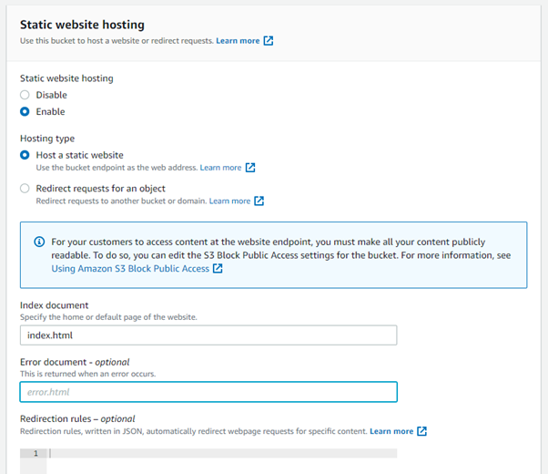
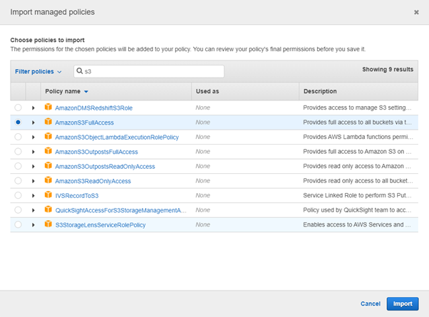

# Boardgame Bazaar - Readme document
<p>
  
</p>

### Website can be viewed here: https://boardgame-bazaar.herokuapp.com/
### Project Github site: https://github.com/C-Undritz/Boardgame-Bazaar
### **Disclaimer: This Website is for educational purposes only.**

------
<span id="top"></span> 
# Table of Contents 

- [OVERVIEW](#overview)
- [STRATEGY](#strategy)
- [SCOPE](#scope)
- [STRUCTURE](#structure)
- [SKELETON](#skeleton)
- [SURFACE](#surface)
- [TECHNOLOGIES USED](#technologies-used)
- [TESTING](#testing)
- [NOTED DESIGN CHANGES](#noted-design-changes)
- [FEATURES](#features)
- [FURTHER DEVELOPMENT](#further-development)
- [DEVELOPMENT AND DEPLOYMENT](#development-and-deployment)
- [DOCUMENTATION REFERENCED](#documentation-referenced)
- [CREDITS AND THANKS](#credits-and-thanks)

------

> # **OVERVIEW**
Boardgame Bazaar is a dedicated online board game store, where customers can easily navigate to view games organised and presented within a number of categories.  Categories are assigned by admin users or are determined through functions based on the saved product data.  Controls exist to preserve stock levels during purchasing so customers are aware as to what is available and are prevented from buying a product that is out of stock.  This combined with an intuitive interface aims to deliver a smooth and enjoyable customer experience to maximise repeat visits to the site

------

> # **STRATEGY**
The board game industry has seen a resurgence in recent years and it is expected to carry on growing further.  Industry forecasters predict the global board game market will be worth more than £9bn by 2023.  For many gamers, the enjoyment of playing board and card games among friends, family members, and fellow enthusiasts is invaluable. And they are willing to pay for the experience, with the majority of gamers (41%) purchasing five to ten new games or expansions a year.

Consequently whilst there are plenty of online board game stores, there is still room in the market for a new store to thrive and succeed.  The goal of this project is to produce an e-commerce store dedicated to the sale of new table top board games.   Whilst other stores offer board games and associated paraphernalia, the focus of boardgame Bazaar will be the sale of the core experience: Games and associated expansions.


<div align="right"><a href="#top">Contents Table</a></div>


# User Stories

| User Story ID | As A        | I want to be able to...                                      | So that I can..                                              |
| ------------- | ----------- | ------------------------------------------------------------ | ------------------------------------------------------------ |
|               |             |                                                              |                                                              |
| 01-01         | Customer    | View all of the products available from the store            | Select a product to purchase                                 |
| 01-02         | Customer    | View a list of products that are on sale, just released and available for preorder | Take advantage of savings, and purchase a new product early  |
| 01-03         | Customer    | Select individual products to view                           | Read additional product details to confirm that this is the item I am looking for and add to my shopping cart (nth: view reviews and ratings on the product) |
| 01-04         | Customer    | Access my shopping cart at any time                          | Check added items and view the purchase total to ensure that I am not spending too much |
|               |             |                                                              |                                                              |
| 02-01         | Customer    | View the products available by board game genres             | More easily find games that match my board game preferences  |
| 02-02         | Customer    | Sort the returned list of board games                        | Easily identify the cheapest/most expensive board games and most highly rated |
| 02-03         | Customer    | Be able to search for a board game by name or description    | Find a specific board game that I am looking to purchase     |
| 02-04         | Customer    | Easily view the search results and number of results         | Quickly determine whether the product I want is available    |
|               |             |                                                              |                                                              |
| 03-01         | Customer    | Easily select the quantity of a board game I would like to buy | Buy multiples of one product in the same purchase            |
| 03-02         | Customer    | View the items in the shopping cart that I have selected to purchase | Keep track of what I have added and the total cost           |
| 03-03         | Customer    | Adjust the quantity of the individual items in my shopping cart and remove them if I wish | Easily make changes to my purchase before checkout           |
| 03-04         | Customer    | Easily enter delivery and payment information                | Check out quickly and confidently with zero hassle           |
| 03-05         | Customer    | Feel that my personal and payment information is safe and secure | Confidently provide the needed information to make a purchase |
| 03-06         | Customer    | View an order after a purchase is made and checkout is complete | Verify that I have not made any mistakes in my order         |
| 03-07         | Customer    | Receive an email confirmation after checkout is complete     | Have a record of what has been purchased should there be any issues |
|               |             |                                                              |                                                              |
| 04-01         | Site User   | Easily register for an account                               | Have a personal account, a profile to view and streamline the checkout |
| 04-02         | Site User   | Easily log in or log out                                     | Access my personal account and streamline the checkout       |
| 04-03         | Site User   | Easily recover my password in case I forget it               | Recover access to my account                                 |
| 04-04         | Site User   | Receive an email confirmation after registering              | Be sure that my account is created and verify that it is myself that set it up |
| 04-05         | Site User   | Have a personalised account page                             | View order history, save, view and update contact and delivery information and view my current credit and trade progress / history |
|               |             |                                                              |                                                              |
| 05-01         | Store Owner | Add a product                                                | Add new items to the store through streamlined interface     |
| 05-02         | Store Owner | Edit and Update a product details                            | Change product prices, descriptions, images, and other product criteria |
| 05-03         | Store Owner | Delete a product                                             | Remove items that are no longer available to buy             |
|               |             |                                                              |                                                              |


<div align="right"><a href="#top">Contents Table</a></div>

------

> # **SCOPE**

# Content

## The presentation of the site is concerned with:

## Functional Requirements
1. Mobile first; the site is designed to work on mobile and tablet screens first, but responsive design ensures that it scales up and looks good on laptop and desktop screens.
2. Flexible Navbar and site options to reflect a logged in user and admin user to restrict some functionality of the website.
3. A contact function/form that will allow the sending of feedback to an existing email.
4. Clear and obvious links to social media platforms.
5. Feedback animations to provide players with clear interaction cues.
6. Interactive functions for user to rate and review a game, and to view feedback provided by others.

<div align="right"><a href="#top">Contents Table</a></div>

------

> # **STRUCTURE**

The website is broadly separated into three sections:

1. Sections and functions accessible whilst not being logged in:

2. Sections and functions accessible when registered and logged in:

3. Sections and functions accessible when logged in as an admin user:

# Navigation

## Navbar
The Navbar is displayed at all resolutions and is a permanet navigation feature.

### Social Icons
- Social icons link to there respective sites and open the social network site within a new browser tab.  
- Displayed permanently within the foot and in the navbar on desktop screens only.

### Account Buttons
- Conditional display of icons and text to login, register, access account, and logout.  Each navigates to the appropriate page.  
- Displayed in navbar at all resolutions though text is not shown on mobile screens; only the icons.
- Admin functions are available within a user account if the user has admin status.

### Shopping Cart
- The shopping cart can be accessed at any point by clicking on the shopping cart symbol in the top right of navbar which will take the user to the shopping cart page.
- Whilst shopping, a preview of the shopping cart is displayed upon the addition an item to the cart.  This is done via a bootstrap5 Offcanvas component.  From within the Offcanvas the user can select to view the shopping cart page or continue shopping.  The Offcanvas is displayed at all resolutions.

### Navigation Menu
- Navigation menu displaying 'home' icon to navigate the user to the landing pages from any page within the site.  
- Shop Front displays a drop-down menu that displays the available boardgames by 'bestsellers', 'new releases', 'pre-orders' and 'on sale'.  
- Shop by Genre displays a drop-down menu that displays the available boardgames by genres that have been assigned to each game.
- The navigation menu is responsive and so content collapses behind a button on tablet and mobile screens

### Brand Logo
- Clicking or tapping the brand navigates the user to the landing pages from any page within the site. 
- The logo is displayed at all resolutions.

### Search Bar
- The search bar will return any boardgames that contain the user input search parameter in the product title or description.
- Displayed as a bar at desktop resolutions and as a button at tablet and mobile resolutions.  Button is tapped to display a search bar.

## Products

### Product Display
- Clicking or tapping on the product image navigates the user to the product detail page for that product

### Product Detail page
- Genre tags are displayed below the product price which allows the user to see other board games within the same genres assigned to the product they are viewing.
- Keep shopping button takes the user to the home page.

## Shopping Cart

## Checkout Page

## login & Register

## Account Page

## Admin Page

## Footer


# Database Schema


# Searching

------

# Consistent Features between pages

------

> # **SKELETON**

# Wireframes
[wireframes_v0.1](assets/readme/boardgame-bazaar_desktop-wireframes_v0.1.pdf)

------

> # **SURFACE**

# Theme

# Colours
In order to simplify the deployment of the website, bootstrap colours have been used as detailed below:

| Bootstrap colour | #hex code |
|------------------|-----------|
| Secondary        | #6C757D   |
| Danger           | #DC3545   |
| Warning          | #FFC107   |
| Light            | #F8F9FA   |
| Dark             | #212529   |


# Text

## Fonts
- [Love Ya Like A Sister](https://fonts.google.com/specimen/Love+Ya+Like+A+Sister?preview.text=Boardgame%20Bazaar&preview.text_type=custom&query=Love): Used for the title of the store in the nav bar
- [Amatic SC](https://fonts.google.com/specimen/Amatic+SC?query=amatic&preview.text=Buy,%20Sell,%20Play&preview.text_type=custom): Used for the store tag line 'Buy, Sell, Play' on the nav bar
- [Economica](https://fonts.google.com/specimen/Economica?query=economica&preview.text=Boardgame%20Bazaar%20website%20content%20will%20be%20written%20in%20this%20font&preview.text_type=custom): Used for all text througout the site

# User interaction feedback

## Buttons
All buttons change colour upon mouse hover

## Social icons
All social icons change colour and size upon mouse hover

------

> # **TECHNOLOGIES USED**

## Languages

- HTML5
- CSS3
- JavaScript
- Python

## Libraries & Frameworks

- [django web application framework](https://www.djangoproject.com/)
- [Bootstrap v5.1.0](https://getbootstrap.com/)
- [Font Awesome](https://fontawesome.com/)
- [Google Fonts](https://fonts.google.com/)

## Tools

- [Gitpod](https://www.gitpod.io/) - chosen IDE for this project.
- [GitHub](https://github.com/) - for storage and sharing of code remotely.
- [Heroku](https://www.heroku.com/) - Hosting provider for app.
- [Amazon Web Services (AWS)](https://aws.amazon.com/) - for hosting of all image files
- [Stripe](https://stripe.com/gb) - for processing of payments
- [Gmail](https://www.google.com/) - service used for django to send emails
- [allauth](https://django-allauth.readthedocs.io/en/latest/index.html) - for site user login and logout of account
- [Balsamiq](https://balsamiq.com/) - to create wireframes.
- [Lucidchart](https://www.lucidchart.com/) - for DB design illustration.
- [Tables Generator](https://www.tablesgenerator.com)
- [jsonformatter.org](https://jsonformatter.org/) - creating json fixture files.
- [favicon](https://favicon.io/) - for generating 32x32 favicon.
- [Am I responsive](http://ami.responsivedesign.is/) - to create the responsive illustrations featured in the TESTING.md.

<div align="right"><a href="#top">Contents Table</a></div>

------

> # **TESTING**

Testing completed is detailed in the [TESTING.md](https://github.com/C-Undritz/Community-Treats/blob/master/TESTING.md) document

------

> # **NOTED DESIGN CHANGES**

# Changes to original design

# New features

------

> # **FEATURES**

# Security

# Data Management and Use
## Product attributes:
### New Releases.
Determined during site startup and when ‘new releases’ selected from the shop front menu through the function ‘determine_new_releases()’ In home app views.py.   

#### Mechanism:
Function checks the recorded release date mandatory field against the date 90 days in the past from the current date.  If the release of the game occurred within the past 90 days then it is checked as being a ‘new release’.

#### Display:
Only games that were released within the last 90 days will be checked as a new release and therefore displayed as such on the website with a banner over the image.

### Pre-orders.
Determined during site startup and when ‘pre-orders’ selected from the shop front menu through the function ‘determine_preorders()’ In home app views.py.   

#### Mechanism: 
function checks the recorded release date mandatory field against the current date.  If the release date of the game is in the future then it is checked as being a ‘pre-order’.

#### Display:
Only games that have a release date recorded in the database that is in the future will be checked as a preorder and therefore displayed as such on the website with a banner over the image.


### Stock.
The stock figure is updated when an item is purchased to reflect the amount purchased.  There are no controls to stop the 'stock' count becoming a minus figure as this should be allowed to highlight if more stock has been sold than is in place.  However there are a number of measures in place to prevent this from happening.

1. To keep the customer informed, the current stock is displayed to the customer along with the product, both on the home page and on the product detail.  If there is over 10 in stock stock then '10+ in stock' is displayed.  If stock is 10 or below, then the actual figure is displayed to the customer as 'X in stock.  If there is no stock then, 'in stock soon' is displayed on the home screen and 'Sorry, currently out of sttock' is displayed within the product detail.  Additionally; to stop the sale of products with no stock, the quantity selector and 'add to cart' button are not displayed.

2. The stock figure is also used to limit the amount a customer can buy at once by affecting the maximum number that can be selected.  If the product stock is more than 9 then the most of any product a customer can buy at once is 10.  However should the current stock fall below 10 then then limit on the quantity selector is set by the current stock number. 

3. At the point of purchase when the customer clicks/taps on the 'complete order' button on the checkout screen, a realtime check is made against the current stock level of each product in the basket and the intended purchase amount. If any of the items purchased quantity is more than the stock figure for that item, the purchase fails and the customer is directed back back to the cart screen.  A message is also displayed explaining this and asks for the customer to recheck the displayed stock levels for their purchase(s).  This is to catch instances where a customer has been able to add items to their cart, but may be slow to checkout and remaining stock has been sold in the meantime.

<div align="right"><a href="#top">Contents Table</a></div>

------

> # **FURTHER DEVELOPMENT**
* The price per item is not shown on the order details; only the order totals are shown, the item(s) bought and quantity of each.  The bought price per item cannot be shown as this is not saved.  Further development will look to save and therefore show the bought price of an item so as to provide more details on each entry within the customer orders history. 

------

> # **DEVELOPMENT AND DEPLOYMENT**

A repository was setup in GitHub using the Code Institute Gitpod [full template](https://github.com/Code-Institute-Org/gitpod-full-template).  Development was completed using Gitpod and code was regularly pushed back to the GitHub repository.  The master branch of this repository is the most current version and has been used for the deployed version of the site.

You will need to install the following into your chosen development environment to run this project:

*	[Python 3 - core code](https://www.python.org/)
*	[PIP - package installation](https://pip.pypa.io/en/stable/)
*	[Git](https://git-scm.com/)

The current live website is hosted as a [Heroku](https://www.heroku.com) app, however the images and static files are hosted on an [AWS](https://aws.amazon.com) simple storage service (s3).  [Stripe](https://stripe.com) is utilised for the management of financial transactions and [Gmail](https://google.com) is used for emails.  The instructions in this section cover the process to set up and use these services. 

# Running the project locally
To work on the project code locally a clone can be taken by following the steps below or downloading the files as a zip file. To see the options, open the desired repository and select the drop down menu button ‘Code’ (found under the repo name and above the list of files).

## Clone:
To do this you will need Git for Windows installed (for other OS versions see [here]( https://git-scm.com/downloads)).

*   Open Git.
*   Change the current working directory is required. On windows, by default, the files will be downloaded to the users file directory on the C: drive.
*   In the ‘Code’ dropdown menu in GitHub, select either HTTPS or SSH and copy the link.
*   In the GitBash window type ‘git clone’ and then paste the copied link:
```
  git clone https://github.com/C-Undritz/Boardgame-Bazaar.git
```
*   Hit Enter and the files will then be cloned to be worked on locally.

Please see [here](https://docs.github.com/en/github/creating-cloning-and-archiving-repositories/cloning-a-repository-from-github/cloning-a-repository) for the GitHub Docs page on this process.

Within your development environment, if needed, upgrade pip locally with the command:
```
  pip install --upgrade pip
```
The cloned repository includes the ‘requirements.txt’ to enable the installation of the packages required for this project using the following command in the terminal:
```
  pip3 install -r requirements.txt
```
Once that is successfully complete, setup a super user to log into django admin and have admin privileges throughout the site, by typing the below into the terminal and following the prompts:
```
  python 3 manage.py createsuperuser
```
## Environment Variables
The following environment variables (in CAPS) must be set within your development environment for the site to function correctly.  These are listed and described below and instructions to obtain these are featured in the following sections.

* DEVELOPMENT
  * Required so that within the development environment, debug = True.
  * *Value: set as **True*** 
* SECRET_KEY
  * Required by Django: A random sequence of characters used to maintain security.  
  * *Value: Django secret key.  A good resource is [miniwebtool – django secret key  generator](https://miniwebtool.com/django-secret-key-generator/) and should be different to the same variable in the Heroku app.*
* STRIPE_PUBLIC_KEY 
  * *Value: from stripe account (see below section [Stripe Setup](#Stripe-Setup))*
* STRIPE_SECRET_KEY
  * *Value: from stripe account (see below section [Stripe Setup](#Stripe-Setup))*
* STRIPE_WH_SECRET
  * *Value: from stripe webhook endpoint (see below section [Create webhook](#Create-new-webhook-end-point)).*  Note that this is different to the one set for Heroku (see below section ?).  

Database migrations will need to be made by following the below commands:
```
  python3 manage.py makemigrations --dry-run*

  python3 manage.py makemigrations

  python3 manage.py migrate --plan*

  python3 manage.py migrate
```
*These commands do not have to be run, but it is bext practice, so that the plan migrations can be viewed before completing them.

The project repository comes with a ‘db.json’ file containing all data added during development which can be used to deploy by running this command within the terminal:  
```
  python3 manage.py loaddata db.json
```

The project should then be push to your repository using the below commands:
```
  git add <name of file> or <.>

  git commit -m *<commit message>*

  git push
```

The application can now be run locally by typing in a terminal window:
```
  python3 manage.py runserver
```

# Heroku Deployment

## Heroku Variables
The following environment variables (in CAPS) must be set within the ‘Config Vars’ section in Heroku for the deployed site to function correctly.   The config variables are added within the Heroku app by selecting the Settings tab, and under the heading 'Config Vars' clicking the button 'Reveal Config Vars' to show the key / value input boxes for the variables.  Instructions to obtain the variables are featured within below sections.

* SECRET_KEY
  * Required by Django: A random sequence of characters used to maintain security.  
  * *Value: Can use django secret key generator (https://miniwebtool.com/django-secret-key-generator/) and should be different to the same variable in the development environment.*
* STRIPE_PUBLIC_KEY 
  * *Value: from stripe account (see below section [Stripe Setup](#Stripe-Setup))*
* STRIPE_SECRET_KEY
  * *Value: from stripe account (see below section [Stripe Setup](#Stripe-Setup))*
* STRIPE_WH_SECRET
  * *Value: from stripe webhook endpoint. Note that this is different to the one set for the development environment (see below section [Create webhook](#Create-new-webhook-end-point)).*  
* DATABASE_URL
  * *Value: automatically setup during Heroku deployment (can be obtained by viewing your Postgres database within the Heroku dashboard, under Settings Database Credentials).*
* USE_AWS
  * Required so that the deployed app uses AWS for images and static files.
  * *Value: set as **True***
* AWS_ACCESS_KEY_ID
  * Required for connection to the AWS s3 bucket
  * *Value: obtained within the downloaded .csv file generated during user creation in AWS (see below section [Create s3 bucket](#Create-s3-bucket)).*
* AWS_SECRET_ACCESS_KEY
  * Required for connection to the AWS s3 bucket
  * *Value: obtained within the downloaded .csv file generated during user creation in AWS (see below section [Create s3 bucket](#Create-s3-bucket)).*
* EMAIL_HOST_PASS
  * Required by Django to send emails using chosen email account
  * *Value: 16 character password provided by, in this instance; Gmail (see below section [Email Setup](#Email-Setup)).*
* EMAIL_HOST_USER
  * Required by Django to send emails using chosen email account
  * *Value: the email address of chosen email account (e.g. `bob.smith@gmail.com`)*

## Deployment
In order to run properly, Heroku requires:
*	requirements.txt
*	Procfile

Both of these files should be within the cloned repository, so ensure these are pushed to your GitHub repository. 

To deploy the app to Heroku from the GitHub repository you will need to follow the below steps:
*	Go to [Heroku]( https://www.heroku.com/).
*	Log in and click on 'New' > 'create new app'.
*	Enter an App name (do not use spaces and use lower case letters).
*	Choose a region, then click ‘create app’.
* Within the new app select the ‘resources’ tab and under addons type in ‘postgres’ to provision a new Heroku Postgres database (this will also add the required DATABASE_URL variable and value in the Heroku Config variables)

### Setup to auto-deploy when pushed to GitHub:
* Within the Heroku web dashboard, Click on the Deploy tab:  

* Select deployment method as ‘GitHub’, and then search for your repository below that.
* Once your repository name is returned, click 'connect'.
* Then click ‘enable automatic deploys’

Within the development environment, in a terminal window, login into heroku by entering the below command and following the prompts.
```
  heroku login -i
```

Then type the below to setup a superuser: 
```
  heroku run python manage.py createsuperuser
```

Database migrations will need to be made to the Heroku postgres by following the below commands (you will need to be logged into Heroku to perform these):
```
  heroku run python manage.py makemigrations --dry-run*

  heroku run python manage.py makemigrations

  heroku run python manage.py migrate --plan*

  heroku run python manage.py migrate
```
*These commands do not have to be run, but it is bext practice, so that the plan migrations can be viewed before completing them.

Once all the configuration variables have been added, the deployed app can then be run from Heroku by selecting it and clicking 'open app'. 

# Amazon Web Services (AWS) Setup
## Create s3 bucket
* Go to [Amazon Web Services](https://aws.amazon.com/) and set up an account if you do not have one.
* Once logged in, under ‘my account’ select ‘AWS Management Console’ and search for the service ‘s3’
* Once in the s3 interface create a new bucket for this project:  

* Name the bucket and select a region closest to you.
* Uncheck block all public access and acknowledge that the bucket will be public:  

* Select ‘create bucket’ to finish and the bucket will be created.
* Under the bucket properties tab, select to ‘edit’ Static website hosting and select ‘enable’.
* Ensure that ‘host a static website’ is selected and enter a default value for index as this will not be used for this project deployment:  

* Click save.
* Next click permissions tab and select to edit the CORS 
* Enter and save the below cors configuration which will set up the required access between the Heroku app and this s3 bucket.
```
[
  {
      "AllowedHeaders": [
          "Authorization"
      ],
      "AllowedMethods": [
          "GET"
      ],
      "AllowedOrigins": [
          "*"
      ],
      "ExposeHeaders": []
  }
]

```
* Next select to edit the bucket policy and select ‘policy generator’ to generate a policy.  Before you do that, copy the ‘Bucket ARN’ as shown below (you will also need this for setting up a group within Identity and Access Management below).  

* Within the policy generator select policy type of ‘S3 Bucket Policy’
* Within Add Statements, select ‘allow’ for effect and type a star within ‘Principal’:  

* For Actions select only ‘GetObject’:  

* Then below that paste in the ‘bucket ARN into the Amazon Resource Name input box.
* Click ‘Add Statement’, then ‘Generate Policy’
* Copy the policy into the bucket policy editor and then so as to allow access to all resources in this bucket, add a slash star onto the end of the resource key:
* Click Save.
* Next select to edit the Access control list and set the list objects permission for everyone under the Public Access section as below:  

 
## Create access policy, group and user
### Create Group and Policy
* Within the AWS services menu open Iam (Identity and Access Management) and in the left hand menu click ‘User groups’ to create a new group.
* Name a new group and click ‘create group’.
* Click ‘policies’ so as to create a policy used to access the new bucket.
* Click ‘create policy’ and then select the ‘JSON’ tab and select ‘import managed policy’.
* Within the search input, search for s3 and then select to import the Amazon s3 full access policy:  

* Modify the policy by entering the ARN from the bucket policy in s3 as the value for resource as below:  

* Click ‘Next: Tags’ and then click ‘Next: Review’
* Provide a name and description for the policy and click ‘Create policy’.

### Attach policy to group.
* Within the AWS services menu open Iam and in the left hand menu click ‘User groups’ to view the newly created group.
* Select the new group and click on the permissions tab
* Click the ‘Add permissions’ button and select ‘Attach Policies’ from the drop down.
* Select the policy that was just created, by checking the tick box and click on ‘Add permissions’

### Create User and add to group.
* Within the AWS services menu open Iam and in the left hand menu click ‘Users’ and then select ‘Add users’
* Provide a name for the user, check the tick box to give the user programmatic access and select next.
* Check the tick box next to the group just created to add the user to the group.  Click through the next few pages to create user.
* **!IMPORTANT:** On the success page, click 'Download .csv file' which contains the user access key and secret access key needed to authenticate them from the django app.

## Connect Django to AWS s3 bucket.
Within the Django app settings python file enter the name and region name for the AWS s3 bucket that you have set up as indicated below:  


Within Heroku add the AWS_ACCESS_KEY_ID and AWS_SECRET_ACCESS_KEY to the config variables and also add a USE_AWS key and set it to true.  The access key and secret key are contained with the **downloaded csv file**.

Once that is done, git add, commit and push the changes which will trigger a deployment to Heroku.  Check the Heroku build log to check that the static files were collected and there should be a 'static' folder within the s3 bucket. 

## Add media files to s3 bucket
The below instructions detail how to do this within the s3 management interface.

* Within the s3 bucket overview click create folder and call it media.
* Inside that folder click on ‘upload’ and then ‘add files’
* Select all of the product images (found within the repo download performed earlier) and click open
* Click next and then under permissions, check the box for ‘grant public-read access’:  

* Then click upload.
* There should now be a 'media' folder within the s3 bucket containing the images. 

# Stripe Setup
* Create a [Stripe](https://stripe.com) account or log in to existing.
* On the Stripe dashboard, under ‘Developers’ copy the ‘test API key’ and ‘ Secret key’.  Use these as the values for the environment and Heroku variables STRIPE_PUBLIC_KEY and STRIPE_SECRET_KEY as detailed above. 

## Create new webhook end point.
**NOTE:** Two separate webhooks will need to be setup. One for the development environment and one for the Heroku app.
* Run the application to get the address of the site.  Copy this and go to the Stripe dashboard.
* Click ‘Developers’, select ‘webhooks’ and then click ‘Add endpoint’.
* Paste in the site URL and add to the end ‘/checkout/wh/’:  

* Click ‘Select Events’ and select the events to listen to as:
```
  ‘payment_intent_suceeded’ 

  ‘payment_intent_failed’
```
* In the newly created webhook endpoint details the ‘signing secret’ is now available.  Copy this and add it to the value for the environment and Heroku variable STRIPE_WH_SECRET as detailed above.
* Within the Stripe dashboard for that webhook, click ‘send test webhook’ and verify that it is working.

The STRIPE_CURRENCY variable is defined within the django app 'settings' python file and is set to ‘gbp’.  If a different currency is needed then this will need to be changed.  See this link for [supported currencies](https://stripe.com/docs/currencies#presentment-currencies)

# Email Setup
The below instructions cover the setup using a [Gmail](https://google.com) account.

* Log in to your email account or set one up.
* Click account settings, and select the 'Accounts and Import' option from the top selection
* Under ‘Change account settings’ click ‘Other Google Account settings’
* Click on the ‘security’ option on the left and then under ‘Signing in to Google’ click on ‘2-Step Verification’
* Click ‘get started’, enter password and then work through the verification.
* Once verification is done and 2-Step verification is turned on, a new option now shows under the previous ‘Signing in to Google’ menu screen.
* In this, on the App passwords screen, select from the dropdowns; ‘mail’ for app and ‘other’ for device.  Add an appropriate name and click ‘generate’.
You will then be given a 16 character password which you will need to copy.

## In Heroku.
Within the Heroku Config variables add the 16 character password as the value to the variable ‘EMAIL_HOST_PASS’.  Add another variable called ‘EMAIL_HOST_USER’ and set the value as the gmail account email used.

<div align="right"><a href="#top">Contents Table</a></div>

------

> # **DOCUMENTATION REFERENCED**

[Django online documentation](https://docs.djangoproject.com/en/3.2/)

------

> # **CREDITS AND THANKS**

# Code
- Thanks to the Code Institute Boutique Ado commercial online store full-stack django project; which was a great introduction to django framework. 
- The use of python datetime in the product models custom manager was referenced from this [listendata.com article](https://www.listendata.com/2019/07/how-to-use-datetime-in-python.html#Calculate-future-or-past-dates)
- Technique for positioning text over an image from [w3schools](https://www.w3schools.com/howto/howto_css_image_text.asp)
- For rendering the game genres as checkboxes: [Django Forms for Many-to-Many Fields](https://medium.com/swlh/django-forms-for-many-to-many-fields-d977dec4b024)
- To get a calender box to show up to pick a date for the 'release date' field in the add products page: [How to use Datepicker in Django?](https://webpedia.net/how-to-use-datepicker-in-django)
- To remove the default increment and decrement mouse selectable controls for the quantity selector input fields the css in this [codegrepper](https://www.codegrepper.com/code-examples/whatever/how+to+disable+html+defualt+increment+decrement+in+number+type) page was used.
- To remove the ability for the customer to type in the number within the quantity selector input fields the jQuery in this [stackoverflow](https://stackoverflow.com/questions/17164278/disable-writing-in-input-type-number-html5) page was used.
- This Youtube tutorial video from [Onthir](https://www.youtube.com/watch?v=lSX8nzu9ozg) was used as a guide when implementing the review and rate features
- This Youtube tutorial video from [Very Academy](https://www.youtube.com/watch?v=H4QPHLmsZMU) was used as a guide when implementing the add to wishlist feature
- The Youtube tutorial videos from [Corey Schafer](https://www.youtube.com/watch?v=acOktTcTVEQ) and [Pretty Printed](https://www.youtube.com/watch?v=wmYSKVWOOTM) were used to learn about the implementation of pagination.
- The jQuery solution to disabling the mousewheel for input elements was found on this [stackoverflow](https://stackoverflow.com/questions/9712295/disable-scrolling-on-input-type-number) post
- For keeping the footer positioned at the bottom of the page at all times, the section called 'There is a flexbox' was used from [this css-tricks.com](https://css-tricks.com/couple-takes-sticky-footer/) page.

# Images and Content

## Images
- stripe logo badge used in accordance with [Stripe Marks Usage Agreement](https://stripe.com/en-gb/marks/legal)


## Content

- Information for Readme Overview section was found in the following websites:
  - [Board games: Why are they becoming so popular?](https://www.bbc.co.uk/news/av/uk-wales-49859688)
  - [Board Game Industry Statistics](https://printninja.com/board-game-industry-statistics/)

# Acknowledgments
- Thanks to the slack community for support and help throughout the course and this project.  Honourable mentions for this project go to Ed B_alum, Gaff Alumnus, Daisy_mentor, @ckz8780, Harry and BenKav_Alumni
- Thanks to @ckz8780 for the support on slack and helping with getting the stock check against purchase quantity working!
- Thanks to BenKav_Alumni for the help in setting up the product model custom manager.
- Thanks to tutor support for all the help throughout this project
- Thanks to Code Institute for the encouragement and great course material. 

<div align="right"><a href="#top">Contents Table</a></div>