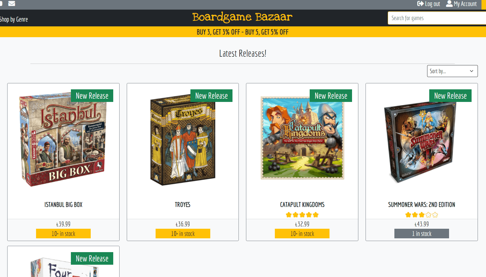

# Community Treats - Testing document

## [Associated Readme document](README.md)

---
# Table of Contents
* [RESPONSIVE DESIGN TESTING](#responsive-design-testing)
* [FUNCTIONALITY TESTING](#functionality-testing)
* [QUALITY CHECKS](#quality-checks)
* [USER STORIES TESTING](#user-stories-testing)
* [PROBLEMS AND FIXES](#problems-and-fixes)
* [REMAINING ISSUES](#remaining-issues)
* [REMAINING BUGS](#remaining-bugs)

---
># **RESPONSIVE DESIGN TESTING**
Research detailed screen resolutions that are most popular today (see [here](https://kinsta.com/blog/responsive-web-design/#common-responsive-breakpoints) and [here](https://www.browserstack.com/guide/responsive-design-breakpoints)).  This information was used along with the required resolutions for [am-i-responsive](http://ami.responsivedesign.is/) to determine 17 resolutions as a guide for media breakpoints and to test for responsive design using Google Chrome DevTools. The resolutions tested were:

    * 1920 x 1080
    * 1600 x 992
    * 1536 x 864
    * 1366 x 768
    * 1280 x 802
    * 1366 x 768
    * 768 x 1024
    * 540 x 720 (Surface Duo)
    * 414 x 896
    * 411 x 731 (Pixel 2)
    * 411 x 823 (Pixel 2 XL)
    * 375 x 812 (iPhone X)
    * 375 x 667 (iPhone 6/7/8)
    * 360 x 720
    * 360 x 640
    * 320 x 568 (iPhone 5)
    * 320 x 480


The responsive design test sheets and results can be viewed using the below link.  

*Note - The test sheet linked below is stored as a single google docs sheet which contains images that do not seem to load in the initial window.   This document is therefore best viewed in Google Sheets once open.*

* [Boardgame Bazaar Responsive Design test results](https://docs.google.com/spreadsheets/d/1PTHKyCaVPzhQT7JCqi54593CAVQ5L__k/edit?usp=sharing&ouid=104452068766757437495&rtpof=true&sd=true)

For each resolution each page was tested to ensure that all text can be viewed and that all features of the page can be seen and do not overlap.

Also successfully tested the live site on the following devices:
* Huawei P smart 2019 smart phone
* Samsung A12 smart phone 
* Laptop at 1920 x 1080 resolution
* Amazon Fire HD 8 tablet
* Apple iPad 7th Generation

---
># **FUNCTIONALITY TESTING**
Functionality testing of all of the implemented CRUD functionality was completed.  This was conducted on a desktop PC using Google Chrome dev tools.

*Note - The test sheets are linked below and are stored as google docs sheet.  Most of these files have mulitple tabs for each function so please do check to see the full range of tests completed.  Some of these also have images and are therefore best viewed in Google Sheets once open.*

The CRUD functionality test sheets and results can be viewed using the below links:
* [CREATE](https://docs.google.com/spreadsheets/d/1PTsEDMkDdj7AsgLVcpOCKGByoNymHInR/edit?usp=sharing&ouid=104452068766757437495&rtpof=true&sd=true)
* [READ](https://docs.google.com/spreadsheets/d/1fq-Ap5ay2DRbzeDHemwrHQIVtluevx2Y/edit?usp=sharing&ouid=104452068766757437495&rtpof=true&sd=true)
* [UPDATE](https://docs.google.com/spreadsheets/d/103pHT4M92T0ZFfyGxakC4zGg8oGG5MuH/edit?usp=sharing&ouid=104452068766757437495&rtpof=true&sd=true)
* [DELETE](https://docs.google.com/spreadsheets/d/1-xNDZeJE4uR0e2nzMVvYhAG6uyje94Mg/edit?usp=sharing&ouid=104452068766757437495&rtpof=true&sd=true)

Additional functionality testing of features that could not strictly be classified into CRUD functionality were tested fully and can be view using the link below:
* [Additional functionality tests](https://docs.google.com/spreadsheets/d/1R0qM85r1GzNTEXL3IEHTt0vUtM-IzWkp/edit?usp=sharing&ouid=104452068766757437495&rtpof=true&sd=true)

># **SECURITY TESTING**
Security testing was conducted to test that any areas of the website that require a login or admin privileges cannot be accessed by manipulation of the url. 

*Note - The test sheet linked below is stored as a single google docs sheet with two tabs and is best viewed in Google Sheets once open.*

The security test sheet and results can be viewed using the below link:
* [Security tests](https://docs.google.com/spreadsheets/d/1eIX7e0-M4NAjG7pzXSSe-55OYpr-q5RO/edit?usp=sharing&ouid=104452068766757437495&rtpof=true&sd=true)  

---
># **QUALITY CHECKS**
# Approach
## CSS style sheet:
The following quality checks were completed on the css style sheet (style.css):
* Manual review on comments against code to ensure relevancy.
* Manual review to ensure all quoted-out code was removed.
* Manual check of the spacing between code lines.
* Code run through [Autoprefixer](https://autoprefixer.github.io/) to ensure compatibility across browsers.
* Code checked on [W3C CSS validation](https://jigsaw.w3.org/css-validator/) using direct input.

## HTML:
The following quality checks were completed on each of the four HTML files:
* Manual review on comments against code to ensure relevancy.
* Manual review to ensure all quoted-out code was removed.
* Manual check of the spacing between code lines.
* Code checked on [W3C Markup Validation](https://validator.w3.org/) using direct input.  Due to the django template code within the HTML this was done by opening each page, right clicking and selecting 'view page source', and then copying the HTML code displayed for direct input.
* Due to the conditional statements within the HTML meaning that different code could be displayed depending on the query; in many cases the HTML from one page was checked multiples times to reflect these instances.  For a full list of the HTML pages checked please see [this list](https://docs.google.com/spreadsheets/d/1Cp0Tx1SQdi9y4CGY0PpubFltkqFZiXuF/edit?usp=sharing&ouid=104452068766757437495&rtpof=true&sd=true). 

## JavaScript:
The following quality checks were completed on each of JavaScript files:
* Manual review on comments against code to ensure relevancy.
* Manual review to ensure all quoted-out code was removed.
* Manual check to ensure that all console.log entries were removed.
* Manual check of the spacing between code lines.
* Code checked on [JSHint](https://jshint.com/) using direct input.  Note that '//jshint esversion: 6' was entered at the top of the code window prior to pasting in JS code. This ensures that the feedback received from JSHint takes into account that the JS code uses ECMAScript 6 specific syntax.  '/*globals $:false */' was also added when using JSHint to check jQuery.

## Python:
* It was decided not to delete app files within each app that were not used and therefore did not contain any code outside of that auto-generated by Django when the app was created.  This is so they are easily available for possible further development in the future.  Therefore all code was quoted out and therefore not part of the quality check.
* All flake8 issues within migrations files were ignored as they were autogenerated. 

The following quality checks were completed on the python files:  
* Manual review on comments against code to ensure relevancy.  
* Manual review to ensure all quoted-out code was removed.  
* Manual check to ensure that all print() entries were removed.  
* Manual check of the spacing between code lines.  
* Addressing all pylint non-compliancy flags in Gitpod.  
* Code checked on [pep8online.com](http://pep8online.com/).  

## Website performance:
The site performance was tested on the following browsers by using Lighthouse :
* Chrome
* Opera
* Edge
* Firefox

N.B: Internet Explorer was not tested as the site uses ES6 so it's not fully compatible with Internet Explorer builds.

---
# Results
## W3C CSS Validation:
* Errors: No errors found across all css files
* Warnings: the only reported warnings were all related to the vendor extensions added by running the css through Autoprefixer. No action was taken to remove these.
<p>
<a href="http://jigsaw.w3.org/css-validator/check/referer">
    
    </a>
</p>

## W3C Markup Validation:
* For all webpages and scenario's tested: No errors or warnings to show ([see results](https://docs.google.com/spreadsheets/d/1Cp0Tx1SQdi9y4CGY0PpubFltkqFZiXuF/edit?usp=sharing&ouid=104452068766757437495&rtpof=true&sd=true)).

## JSHint:
Only three files of the thirteen files reported back potential issues:
* stripe_elements.js:
```
One undefined variable
16  Stripe
```
This is the accessing of the Stripe function which is available and declared in the global scope from a library function.  No action taken.
* go_back_script.js:
```
One unused variable
4 goBack
```
This is used within the HTML file that references this function.  No action taken.
* required_bootstrap.js
```
One undefined variable
11 bootstrap
18 bootstrap
```
This is from bootstrap and is required to create an instance of the bootstrap toast and offcanvas. This is declared in the global scope from the library function

## Python PEP8:
All python files passed as PEP8 compliant by pep8online.com and most pylint warnings were addressed. However there were a number of pylint problems reported within Gitpod which are detailed below with the response:

Remaining pylint warnings and reasons:
* There are several warning shown from the migrations files. These are ignored as they are created by Django and should not be edited.  This issue has been marked as a ['won't fix'](https://code.djangoproject.com/ticket/30555) by the Django team.
* "Class 'X' has no 'DoesNotExist' member" and "Class 'X' has no 'objects' member".  These were ignored as Django adds the `objects` and 'DoesNotExist' properties to all model classes, therefore the IDE isn't aware of this.
* "Avoid using null=True on string-based fields such CharField".  The django documentation outlines that this is normally a valid error to avoid two possible values for "no data": Null and the empty string, which is redundant.  However an exception to this is where "blank=True is also set which is the case in every instance that this pylint warning occurs.
* A number of flake8 warnings stating that the Django 'instance' parameter was unused.  These were ignored as it is understood that this was because instance was not mentioned explicitedly in the function however it is used and therefore required.
* There were a number of flake8 warnings within the two signals files highlighting unused arguments.  These were ignored as these are a required by Django for signals to function.
* checkout > `apps.py` and products > `apps.py`:  flake8 warning that 'signals' imported but not used: This is the method for enabling a required signals file within django and so ignored.
* checkout > webhook_handler.py: lines 79 and 80  - E501 line too long (80 > 79 characters): Both these lines are 80 characters long and so were recognised but not refactored or adjusted to ensure that the app functioned correctly.

## Lighthouse results:
### Chrome:

### Opera:

### Microsoft Edge:

### Firefox:


Brief testing on Safari browser was conducted by using the website on a relatives iPad.  The website functioned as expected and no problems observed.

---
># **USER STORIES TESTING**
The below details how the website meets the requirements of each user story. 

# Customer and first time user of the software
## 01-01. View all of the products available from the store
The customer is greeted with the home/landing page which features a central CTA button which takes the user to a screen which shows all products available in the store.  The all product screen can also be accessed at any time from the 'Shop front' drop down menu in the navbar.  Any view that displays multiple products, shows the game rating (if any) price and sale price (if on sale), stock information and whether the product is a new release, pre-order or on sale by displaying a flash in the top right of the image.


## 01-02. View a list of products that are on sale, just released and available for preorder
On the home/landing page below the top banner, three images with buttons represent three categories that the products can be assigned: New releases, pre-orders and on sale.  clicking/tapping on the buttons or images will take the customer to a page that will display only products that currently are assigned these categories. If they are, it is displayed with a flash in the top right of the product image. These pages can also be access at any time from the 'Shop front' drop down menu in the navbar. 




## 01-03. Select individual products to view
From any of the views showing mulitple products or any search results, the product image can be clicked/tapped on to display more details of the product.  This includes the ability to add to the wish list, view the stock level, add it to the cart and see the product description, ratings and reviews (if any).

## 01-04. See what is popular
On the home/landing page below the top banner, the first image on the right with a button allows the customer to view the best sellers.  Clicking/tapping on the button or image will take the customer to a page that will display the current top 10 best sellers.


## 01-05. Access my shopping cart at any time
The shopping cart preview displays whenever a product is added to the cart and shows the totals for the items currently within it.  The customer can then choose to continue shopping or checkout from there where they will be taken to an interactive cart page.  From any page within the site though the user can click/tap on the cart icon in the top right of the navbar to view the current cart.  The cart icon also displays the amount of items in the cart at all times.


## 02-01. View the products available by board game genres
All of the board games can be assigned mulitple genres and therefore can be displayed in these genres.  To do this the chosen genre is selected from the 'Shop by genre' drop down menu in the navbar.  This will then display all products that have that genre assigned.  The product details page also displays the genres tags associated with that product.  Any of these tags can be clicked/tapped to display all products that have that genre assigned. 


## 02-02. Sort the returned list of board games
All screens that display mulitple products (apart from best sellers) all have a drop down sort function that allows the customer to sort by: Price (low to high and high to low), rating (low to high and high to low), and name (A-Z and Z-A).  

## 02-03. Be able to search for a board game by name or description
## 02-04. Easily view the search results 
The customer can search for a game using the free text search function permanently available within the navbar.  The website will return any games that contain the search word or term in the games name or description once the user clicks/taps the magnifying glass icon on the right of the search input.  The games can then be selected to view their product details page.


## 03-01. Easily select the quantity of a board game I would like to buy
Within each products details page, there is a mobile friendly quantity selector that allows the user to increase or reduce the amount of a product they would like to add to the cart.  The quantity selector will allow the user to add a maximum of 10 of one item, or the maximum stock that is available if that is 10 or less.  The same quantity selector is also featured within the cart for each item so final adjustments can be made there prior to checking out.
## 03-02. View the items in the shopping cart that I have selected to purchase
## 03-03. Adjust the quantity of the individual items in my shopping cart and remove them if I wish
The shopping cart preview displays whenever a product is added to the cart and shows the totals for the items currently within it.  The cart page is accessed from this or the cart icon in the top right of the navbar.  The cart page displays each added product as one line item.  On each line the product image and name displays, the price, and the sub total for each line. Also displayed on each line is a quantity selector and a bin icon.  To adjust the quantity the customer can use the quatity selector and then click the refresh button next to it.  To remove an item from the cart, the customer can use the bin icon which, once clicked/tapped, will remove the associated item.  To complete the purchase the customer then clicks/taps the secure checkout button at the foot of the cart page.
## 03-04. Easily enter delivery and payment information
In order to complete the purchase the customer needs to provide name, address and contacts details and these are requested from a simple form where mandatory details are clearly marked with an '*'.  payment is required by card and, for ease, all details required are requested within one single Stripe powered input element. 
## 03-05. Feel that my personal and payment information is safe and secure
The secure transaction via the site is powered by Stripe whish is clearly stated at the foot of the page below the form buttons.  This icon is linked to the Stripe webpage so the customer can click on this and read about the technology that Stripe utlise to make payments secure.
## 03-06. View an order after a purchase is made and checkout is complete
## 03-07. Receive an email confirmation after checkout is complete
Following a successful purchase, the customer is presented with a checkout success page detailing every aspect of the transaction.  An email is also sent to the provided email with the same information as a record of the transaction.
## 04-01. Easily communicate with Boardgame Bazaar
The website provides a 'contact' form that can be accessed from the footer at all times and the navbar (at desktop resolutions) that display a simple form for the customer to fill out.  This will then send an email to the boardgame bazaar email account displaying clearly who it is from, the details of the enquiry and the email for boardgame bazaar to respond. 
## 04-02. Sign up for the newsletter
At the foot of the landing/home page above the footer, there is the opportunity for any customer whether registered or not, to subscribe to the boardgame bazaar newsletter.  A check ensures that identical emails cannot added to the mailing list.  Additionally, if a customer subscribes to the mailing list and later registers with the same email address, then their account page will display this and the subscription stays in place.   
## 04-03. Link to boardgame bazaar social media
The website displays all social media icons where boardgame bazaar have a prescence (or plan to in the future) in the footer at all times and the navbar (at desktop resolutions).  When clicked/tapped the social media site selected opens in a different browser tab/window.

# Site User
## 05-01. Easily register for an account
## 05-02. Receive an email confirmation after registering
When the customer is not logged in, two options appear in the top right of the navbar: Login and register.  Clicking on register takes the customer to a small form where they are required to enter an email, username and password.  An email will then be sent to the address provided to ensure the creator is the owner of the email address.  The email has details and a link which will allow the customer to complete registration for their account.
## 05-03. Easily log in or log out
To login the customer selects 'login' from the top right of the navbar.  They will then be required to enter their username and password.  Once logged in a logout link is permanently displayed in the top right of the navbar.  A logout button is also permanently displayed in the account pages.  
## 05-04. Easily recover my password in case I forget it
Should the password be forgotten then the customer can click on the 'forgot password?' link on the login page.  This will then take the customer to the Password reset page where they can enter their email address to have a link sent to allow them to reset their password.
## 05-05. Have a personalised account page 
## 05-06. Add/remove games that I may purchase to a wishlist
## 05-07. Manage whether I recieve a news letter 
## 05-08. Add and edit a review of any item I purchase 
The account pages allows the customer to fill in their first name and surname, and default address information.  This is not required, but it makes checkout easier as this information will automatically populate the checkout form.  The user can also update username and email address information from here and manage their subscription to the mailing list.  An order history is displayed in a summary list but each orders details can be viewed by clicking on the order reference link.  From here each product ordered is displayed alongside a review button which will allow the customer to rate and review that product, or, if they have already provided a rating and review, then edit or delete it.  Finally, any products added to their wishlist (using the button within the product detail form) will be displayed here where they can remove any if the products listed by clicking on the remove button.

# Store Owner
## 06-01. Add a product
The admin functions are available from a button within the account page if the user logged in.  Clicking on this button then displays 'add product', 'edit product', 'add genre' and 'edit genre'.  Clicking 'add product' takes the user to the add product form where required information is displayed with an '*'.  The product is added to the database upon the user clicking on the 'add product' button at the foot of the form.  A case-insensitive check occurs on the name of the product to ensure that a duplicate is not added to the database.
## 06-02. Edit and Update a product details
Clicking 'edit product' displays a paginated list of all the products, each one listed with an edit and delete button.  Selecting the edit button next to the product requiring edit opens the edit product form which is pre-filled with the product details to be changed/updated.  Editing any details and selecting update product will update the product database record.  For convenience the ability to edit a product can also be selected from the product details page.  When viewing a product whilst logged in as an admin user, admin functions are accessible below the product description.
## 06-03. Delete a product
Clicking 'edit product' displays a paginated list of all the products, each one listed with an edit and delete button.  Selecting the delete button next to the product that requires removal opens a confirmation window asking to confirm the requirement to delete the product.  Selecting delete will remove the product from the database.  For convenience the ability to delete a product can also be selected from the product details page.  When viewing a product whilst logged in as an admin user, admin functions are accessible below the product description.
## 06-04. Manage the attributes assigned to a product
The attributes are a product are the assigned genres, and whether it can be considered a pre-order or new release and finally whether it is on sale or not.  The assignment of genres and on-sale status is determined manually.  One or more genres can be assigned to the product when it is created or updated.  To put a product on sale, the 'on sale' checkbox need to be checked and a sale price entered.  Weather a product is a 'new release' or 'pre-order' is determined by the software depending on the release date set when adding (or updating) the product.
* A product will be considered a new release if the release date occured within the last 90 days
* A product will be considered a pre-order if the product exists in the database and the release date is in the future.
The date is constantly checked so these attributes are constantly checked and so when they no longer apply they will automatically be removed.  So requiring no manual intervention once they are set up. 
## 06-05. Track and manage stock of each item
The following features allow for the management and tracing of stock:
* The stock level of an item can be set when the product is created or edited.  However, for convenience the ability to edit a product stock level can also be selected from the product details page.  When viewing a product whilst logged in as an admin user, admin functions are accessible below the product description and 'update stock' is one of those functions.  Selecting this will take the user to a simple form where the stock amount can be adjusted.
* Upon completion of a purchase the stock level of bought items is updated within the database.
* Customers cannot select more stock than there is available to add to their cart.
* A final check is completed at the point of purchase that prevents a sale completing if any quantity of item within the cart is more than there is stock available.  Note that the purchase of pre-orders is allowed and the minus figure will indicate the require stock to fulfill the pre-orders.
## 06-06. Provide a secure shopping experience
The site has been throughly tested so as to ensure that customer details cannot be accessed by other customers and any attempt to do so through url manipulation results in an appropriate message displayed and the blocking of further navigation. 

---
># **PROBLEMS AND FIXES**

## 1. Pushing secure information to GitHub
**Issue**: By mistake the Django secret key and the Postgres Database URL were pushed to GitHub.  
***Solution**: In both instances the values were changed to new values straight away and added as environmental variables so as to not feature within any file within the repository.  The code was then pushed again.  Therefore whilst there are values for these within the Github repository version history, these values are no longer valid and cannot be used to compromise the security of the site.*

## 2. Deleting an Order
**Issue**: When deleting orders within the admin the error "'>=' not supported between instances of 'NoneType' and 'int'" was returned.  
***Solution**: It was found that this was an issue with the def update_total(self) function within the Order Model.  Upon delete the variable 'quantity_total' was 'None'.  It was understood to be due to the fact that the save function on the OrderLineItem model executes first which initiates the update_total function on the Order model and therefore there would be no line items to iterate through as they would have been deleted and the value therefore 'None'.  To solve this and allow a delete to occur, an if statement was added (line 66) before the discount is determined to determine if quanity_total has a value and the discount determined only if this is true.*

## 3. Displaying rating stars 
**Issue**: The code for the rating stars was the same custom code from my other project 'Community Treats'.  However here when the stars were rendered, the radio buttons were also showing:  
  
***Solution**: a similar question was asked on [stackoverflow](https://stackoverflow.com/questions/29346385/hide-radio-button-while-keeping-its-functionality/29346555) and one of the answers featured on the page detailed the below css fix which, when applied, solved the issue:*
```
.radio-item {
    position: fixed; 
    opacity: 0;
}
```
  

## 4. Restricting interaction with the quantity select input box
**Issue**: Within the product detail page and the cart page, it was found that the customer could use the keyboard to enter any number above the stock limit of the input max figure of 10.  it was also found that the built in increment and decrement mouse functions could be used to select a figure above the stock level (should it be less than 10), to the max of 10.  
***Solution**: To limit how the customer can interact with the quantity selector inputs, the ability to use the built in increment and decrement functions and the keyboard was limited (see code section in credit and thanks).  This will then direct the customer to use the custom mobile friendly increment and decrement functions.*

## 5. Form input elements affected by mouse wheel
**Issue**: It was found when entering a number value into any form input element and then scrolling the mouse wheel to navigate the form changed the input value (up or down depending on the scroll wheel direction) whilst the cursor was briefly still within the input box.  Therefore when making a price entry of 69.99 it would be very easy to make it then appear as 69.97 or 69.98.  
***Solution**: This was solved by disabling the mousewheel for all input elements throughout the site.  The jQuery solution was found [here](https://stackoverflow.com/questions/9712295/disable-scrolling-on-input-type-number)*

## 6. If quantity value deleted and add to cart button selected error resulted.
**Issue**: Efforts were made to reduce the ways that the customer can interact with the quantity input so that they have to use the mmobile friendly buttons provided.  The code put in place to do this is described above and in the code section in credit and thanks in the Readme.  However the backspace key could not be disabled which resulted in the customer being able to click within the quantity select input field and delete the value.  If the 'add to cart' button was then selected, the error below resulted.
  
***Solution**: This was solved by adding 'or 1' to the query that determines the quantity variable in add_to_cart view in the cart app (line 24) as shown below.  This ensures that even if there is no value in the quantity input and 'add to cart' is selected, that one item is added and no error occurs.*
```
quantity = int(request.POST.get('quantity') or 1)
```

## 7. Mailing list status check when username changed in accounts results in 404 error
**Issue**: The customer is able to update their username within account information, however once the mailing list status check was implemented this resulted in 404 error once 'update information' was selected.  
***Solution**: It was determined that this was because of the query for the updated_profile variable was still using the 'request.user' to determine the username value for the get_object_or_404 query, and the request.user had not yet been updated with the new username value.  This has been fixed by obtaining the username value for the get_object_or_404 query from the value in the form (line 53 in `views.py` in profile app) and therefore will be current whether the username was updated or not everytime the query runs.*  

## 8. 500 error caused when writing a review
**Issue**: During testing a review was written that when submitted caused a 500 error.  It was determined that this was because the review length exceeded the max length of 500 set against the review field in the Review model.  
***Solution**: This was fixed by add the HTML attribute 'maxlength' to the textarea HTML tag and setting it to 500; matching the database value.  This resulted in the review not being able to be over 500 characters in length and therefore preventing the error from occuring.*

## 9. CSS styles for genre check boxes
**Issue**: The css styles for the positioning of the genre select boxes with the add product and edit product form should be within the products app static css file. However it was found that when the static css file was referenced in the add_product file within the  tags it resulted in the admin and account menu buttons becoming mis-aligned.  It was found that this was the case even if the products.css file contained no code.  

***Solution**: The cause of this was not found. However it was found that the styles could still be applied to the edit and add product pages and not impact the alignment of the buttons by placing them within the base.css.  So this is what has been done.*

## 10. Gaining iamresponsive screen grabs
**Issue**: The live website would not show up within [http://ami.responsivedesign.is/](http://ami.responsivedesign.is/).
***Solution**: Installed on the Chrome browser the extension 'Ignore X-Frame headers'.  This drops X-Frame-Options and Content-Security-Policy HTTP response headers, allowing all pages to be iframed.  Once this was installed, the website showed up in iamresponsive allowing for screen grabs to be taken. Thanks to @Harry for this solution.*

---
># **REMAINING ISSUES**
## 1. Stripe card payment font display
**Issue**: The font family for the Stripe card display element is set within style variable in the stripe_elements js file.  It has been set of the main chosen font throughout the site 'Economica'.  However, the font is not displayed.  During development it was not determined why this was the case.

## 2. Unable to sort the top ten bestsellers so sorter removed from now.
**Issue**: The products returned for the display of bestsellers are already sorted within the all_products view function in the products app.  The use of the drop down sort function refreshes the view and so when this happens the selected sort if not returned; the products returned by 'sold' order is.  A solution to this was not found during developement and so whilst this situation remains the drop down sort function is not displayed within the best sellers page.

># **REMAINING BUGS**
## 1.  HTML/XML character entity for an some special characters displaying in emails when using templates
**Issue**: The contact us function uses email txt templates to arrange the text sent in the contact us form into a more presentable and easy to read format.  However this has resulted in some special characters such as ' " and & being rendered in their HTML/XML character entity within the recieved email.  Whilst this does not prevent the message being read and understood, it is an issue that the developer will seek to fix in further development.

## 2.  Product delete resulting in deletion of product from orderlineitem of an order
**Issue**: During testing it was found that the deletion of a product also caused any instance of that product as an orderline item was deleted.  This creates problems for the order history records.  This was not fixed during developement due to insufficent time.  However likely fixes that could be explored within the current database structure are: 
1. Refactoring the delete product function so that the record is not deleted, but 'retired' from the store so that it is no longer available to purchase.  However it will persist as a record within the database to maintain the intergrity of the order histories
2. Not fully explored but a solution could be utilising signals and using a pre-delete signal receiver to convert the to be deleted product information to strings to be stored in place of the deleted item.